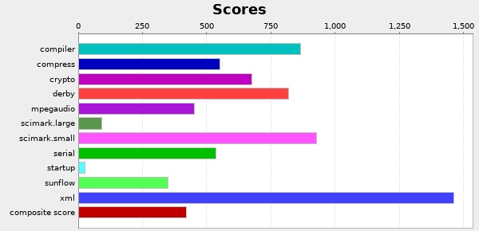
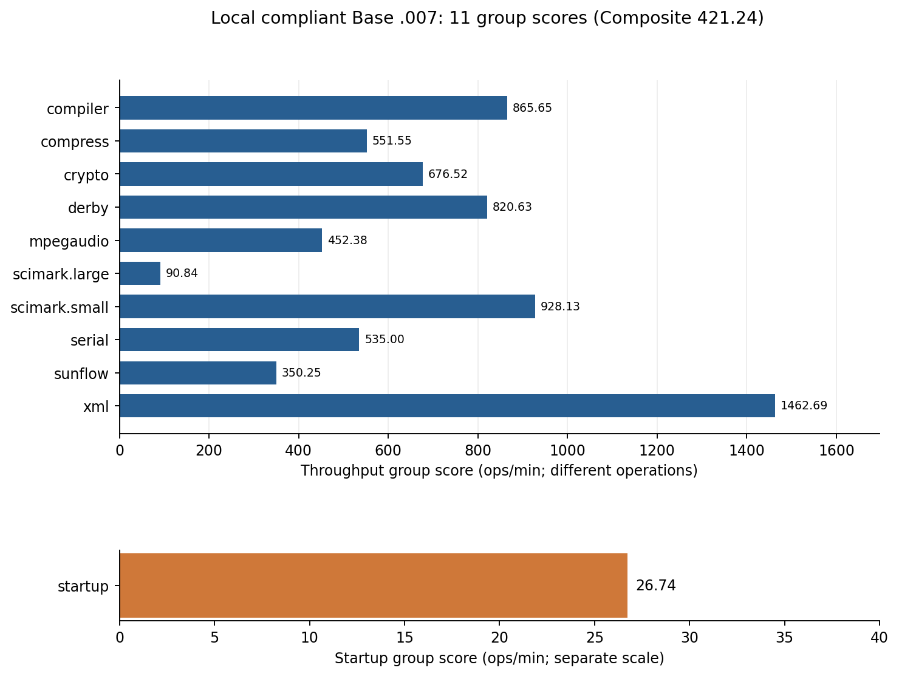
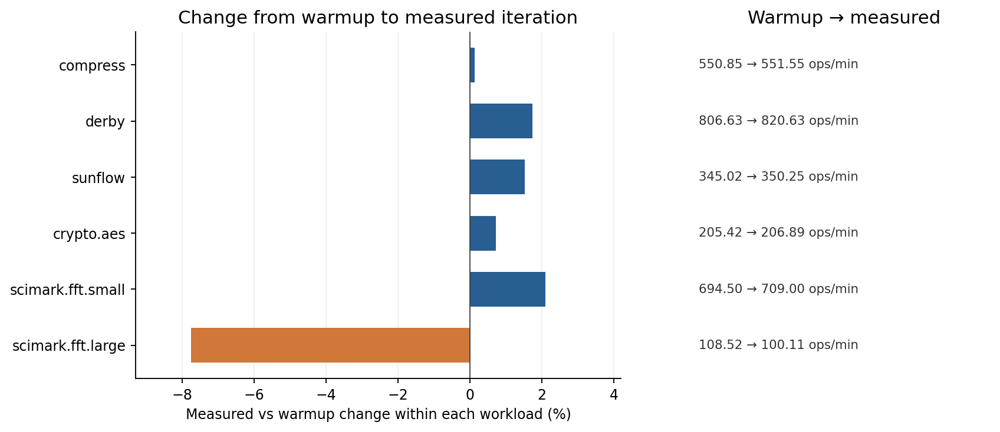
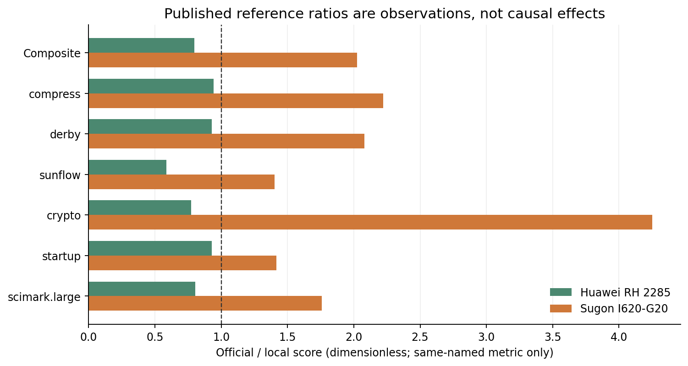
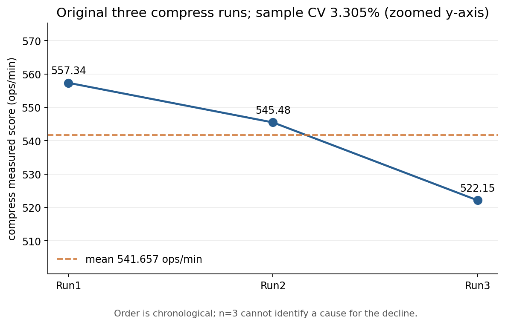
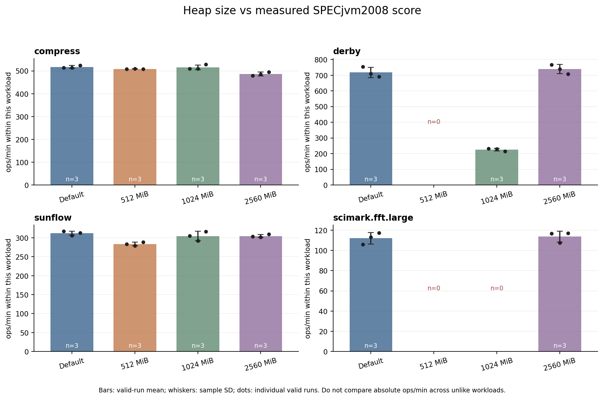
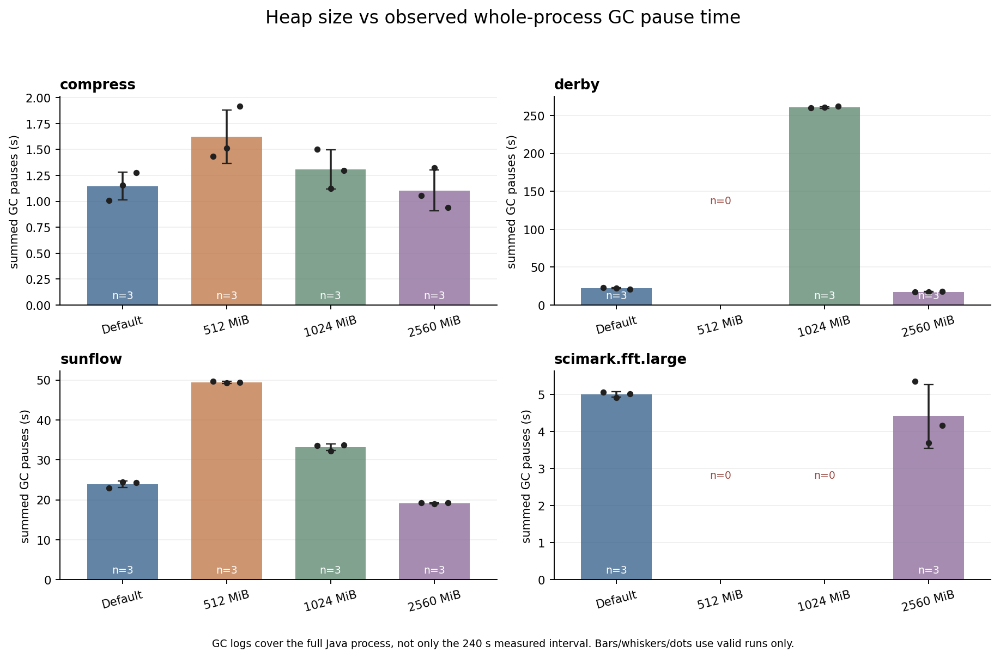
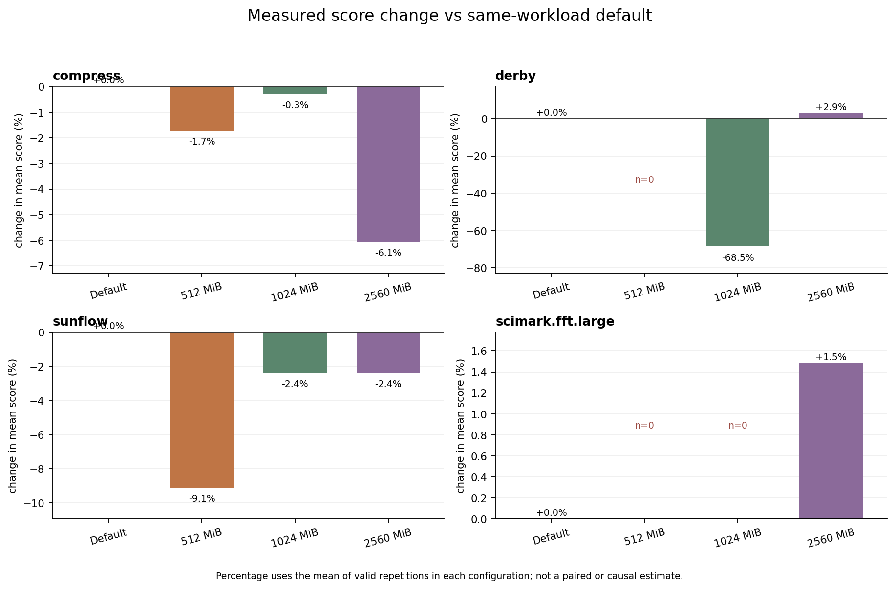
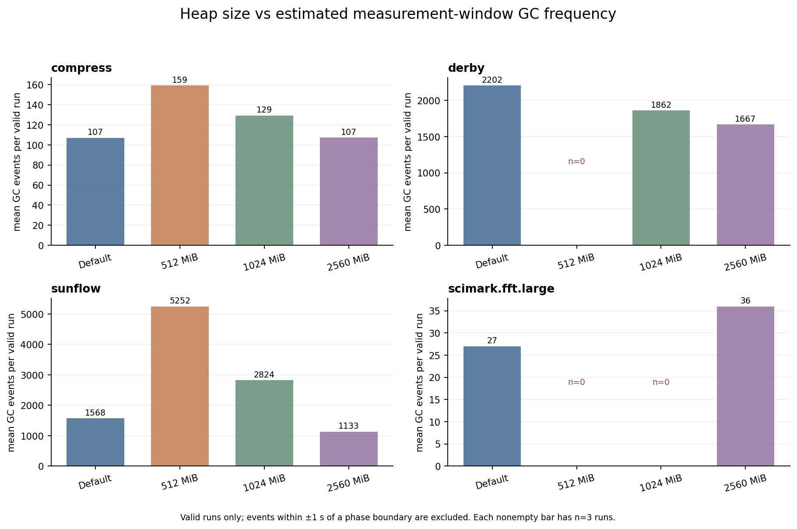
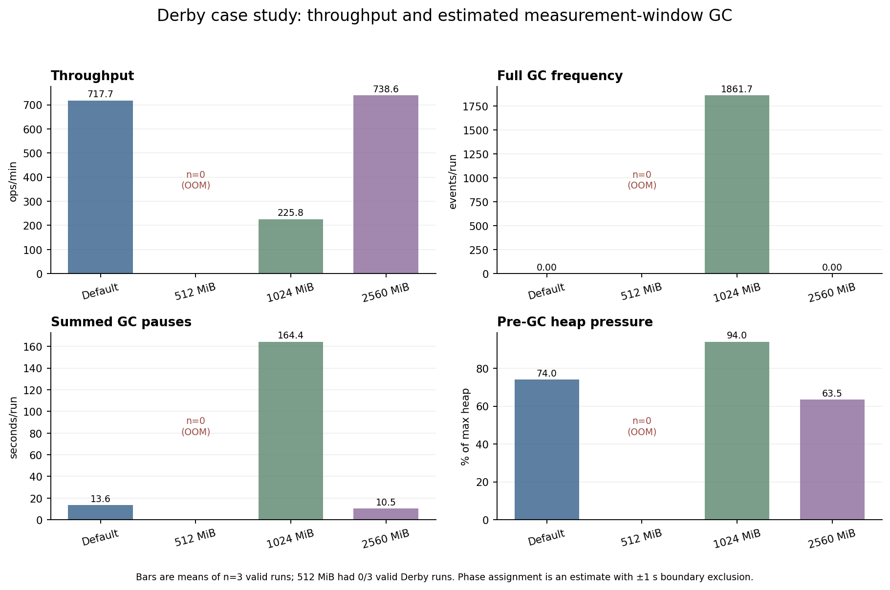

# A2 SPECjvm2008 基准评测

学号：10245102457　姓名：谷秉仁<br>
实验日期：2026-09-30（北京时间）　提交分支：`homework02`

**核心结果：** 在 WSL2 Ubuntu 24.04、OpenJDK 7u75 RI、16 个 benchmark 线程下，完整运行 SPECjvm2008 1.01 Base，结果编号 **`SPECjvm2008.007`**，综合得分 **421.24 SPECjvm2008 Base ops/min**。本地 SPEC 报告标记 **`Run is compliant`**；这不是声称该结果已经提交或获 SPEC 官方发表。[正式文本报告](specjvm2008/results/SPECjvm2008.007/SPECjvm2008.007.txt)与[原始 raw](specjvm2008/results/SPECjvm2008.007/SPECjvm2008.007.raw)是本文所有本机正式分数的起点。

## 1. 实验目标

按课程要求完成一次可复查的标准 benchmark 流程：检查并记录系统/JVM 环境，安装原版套件，执行完整 Base，分析不同 Java workload 的性能特征，与一份 SPEC 已发表 Base 结果作有边界的比较，并以同环境三次单项重复量化波动。重点不只是获得总分，还要核实有效性、保留原始输出，并区分测量事实、观察、机制解释与尚未证明的因果关系。课程只要求 Base；选做参数试验另行保留，不纳入正式 Base 结论。

## 2. SPECjvm2008 背景与计分

### 2.1 SPEC 与标准基准测试

[SPEC](https://www.spec.org/spec/spec.html)（Standard Performance Evaluation Corporation）制定并维护标准化性能基准及结果规则。统一 workload、计时、正确性检验和配置披露，让成绩具备可复核的共同语境；它并不能替代实际业务负载或消除不同平台的全部混杂因素。[Run and Reporting Rules](https://www.spec.org/jvm2008/docs/RunRules.html)规定何种运行可报告为合规成绩。

### 2.2 测量对象与 workload 覆盖

按 [User’s Guide §1](https://www.spec.org/jvm2008/docs/UserGuide.html)，SPECjvm2008 主要测量 JRE（JVM 及类库）执行单个应用时的性能，也反映硬件 CPU、内存子系统与 OS 的影响；它对文件 I/O 依赖较小，不包含远程网络 I/O，因此不是磁盘、网络或完整服务端系统的通用基准。

| 类别与代表项 | 工作内容 | 可能敏感的路径（设计推断，并非本机瓶颈判决） |
|---|---|---|
| `compiler` | 旧版 javac 编译 Java 源码 | 解析、对象分配、类库与 GC |
| `compress` | 改进的 LZW 数据压缩 | 字典访问、整数计算、分支与局部性 |
| `crypto` | 对称/非对称加密、签名验签 | JCE Provider、整数/位运算、指令实现 |
| `derby` | 嵌入式数据库业务 | `BigDecimal`、分配、锁、缓存 |
| `sunflow` | 并行全局光照渲染 | 浮点几何计算、内部并行与调度 |
| `xml` | XSLT 变换及 Schema 校验 | 解析、类库实现、对象分配 |
| 其他 | `mpegaudio`、`serial`、`scimark`、`startup` | 音频解码、序列化、科学计算及 JVM 冷启动 |

各项的官方定义与更多敏感因素见[背景资料](analysis/specjvm_background.md)及[SPEC benchmark 说明](https://www.spec.org/jvm2008/docs/benchmarks/)；`crypto.aes` **并非纯 AES 微基准**，其定义还含 DES/CBC 路径。

### 2.3 测量、汇总与 Base/Peak

一次 *operation* 是该 workload 固定的一份工作，**不同项的 operation 并不等量**。吞吐项默认预热 120 秒、正式迭代 240 秒，按 `operations × 60000 / 实际耗时(ms)` 计算 ops/min；预热不计最终分数。`startup.*` 则为每个任务启动新 JVM，含义与长时间吞吐不同。套件先对同类子项求几何平均，再对 **11 个组**求几何平均形成 Composite；它不是把各项 ops/min 相加。[User’s Guide §1、§6](https://www.spec.org/jvm2008/docs/UserGuide.html)

| 类别 | JVM 调优及计时 | 用途 |
|---|---|---|
| Base（本次正式运行） | 不允许手工 JVM 调优，使用规定的默认时长；可以披露并设置 benchmark 线程数，须运行完整套件并通过检验 | 较可复查的默认式比较 |
| Peak（本次未运行完整套件） | 规则内允许披露后针对性 JVM 调优 | 考察调优后性能 |

这不是说 Base 禁止 OS/硬件设置，也不是说 Peak 可以忽略正确性。[User’s Guide §1.4](https://www.spec.org/jvm2008/docs/UserGuide.html)、[Run Rules](https://www.spec.org/jvm2008/docs/RunRules.html)和[FAQ](https://www.spec.org/jvm2008/docs/FAQ.html)给出边界。仅选一个 workload 的重复或诊断可以有效，却不能称为完整合规 Base。

## 3. 实验环境

以下是**正式测量时**的环境，不把后续诊断时变化的 WSL 内核当作旧运行环境。原始命令输出（`uname -a`、`lsb_release -a`、`/etc/os-release`、`lscpu`、`free -h`、`java -version`、`javac -version` 及环境变量）见[环境原始记录](environment/environment_info.txt)，解释见[环境摘要](analysis/environment_summary.md)。

| 项目 | 实测/配置 |
|---|---|
| 宿主机 | Windows 11 Home；Guest 为 WSL2 Ubuntu 24.04 LTS，正式环境采集时内核 `6.18.33.2-microsoft-standard-WSL2` |
| CPU | AMD Ryzen 9 7940HX；16 物理核、32 逻辑线程，x86-64；WSL 可见 32 CPU |
| 内存 | WSL 可见总量 7.4 GiB、采集时可用 6.0 GiB，另有 2.0 GiB swap；不是宿主物理内存总量 |
| 测量 JVM | 独立安装的 OpenJDK **1.7.0_75 RI**，HotSpot `24.75-b04`，`javac 1.7.0_75` |
| 套件 | SPECjvm2008 **1.01 (20090519)**；安装在 WSL 的 `/home/gubingren/benchmarks/SPECjvm2008` |
| 环境变量 | `JAVA_HOME=/home/gubingren/java/java-se-7u75-ri`；`PATH` 首项为 `$JAVA_HOME/bin`；`CLASSPATH` 为空，完整原值见原始记录 |
| 正式线程设置 | `--base -bt 16`；这是 benchmark 线程配置，不代表 Java 进程总线程数恒为 16 |

套件与 JDK 安装于 WSL 独立目录，没有替换系统 Java；仓库保留[安装位置/校验和](specjvm2008/INSTALL_LOCATION.txt)、执行脚本、完整日志及[完整 results 目录](specjvm2008/results/)，不在 Git 中重复提交大型安装包/JDK 压缩包。当前仓库检出目录与当时实验目录不同；历史脚本内的固定路径要调整后才能在新目录执行，不能声称“克隆即一键重跑”。

## 4. 安装、兼容性与实验配置

### 4.1 原版安装与版本选择

先发现系统有 Java 17、无可用 SPEC 安装。按课程建议独立安装 [OpenJDK 8u41 RI](https://download.java.net/openjdk/jdk8u41/ri/openjdk-8u41-b04-linux-x64-14_jan_2020.tar.gz)，再从 [SPEC 官方安装包](https://www.spec.org/downloads/osg/java/SPECjvm2008_1_01_setup.jar)安装 1.01；安装包 SHA-256 为 `4d3ed86fa7141abf6bef45bc738916d06abc1ebad23423115787f5d8a5e69cde`，JAR 可列目录。安装命令是 `java -jar downloads/SPECjvm2008_1_01_setup.jar -i console`，未修改套件 properties。Java 8 的完整 Base 尝试卡在 `startup.compiler.sunflow`：jstack 显示 javac 输出诊断时线程受阻。SPEC [Known Issues §8](https://www.spec.org/jvm2008/docs/KnownIssues.html)指出旧编译器不兼容 Java 8+ 类库；删去 compiler 项会失去完整性。于是另装 [OpenJDK 7u75 RI](https://download.java.net/openjdk/jdk7u75/ri/openjdk-7u75-b13-linux-x64-18_dec_2014.tar.gz)作为**测量 JVM**，先用短项验证 `startup.compiler.sunflow` 可运行，再执行完整套件。选择 Java 7 的首要理由是兼容性，**不是证明它更快**。[安装记录](logs/install.log)、[Java 8 失败输出](logs/base_run_java8_failed.log)、[线程栈](logs/startup_sunflow_hang_jstack.txt)及[Java 7 检查](logs/java7_compiler_check.log)保存了该链条。

### 4.2 32 线程 OOM 与 16 线程决策

WSL 可见 32 逻辑 CPU，但仅有 7.4 GiB 内存。默认线程数试跑在 `scimark.fft.large` 暖机期间出现 `OutOfMemoryError` 和 `NOT VALID`，不能当成绩；其日志机器时间为 **15:06:31–16:00:50**。SPEC [Known Issues §1](https://www.spec.org/jvm2008/docs/KnownIssues.html)说明活数据量随 benchmark 线程数增加，可通过 `-bt` 降低。**16:07:35–16:09:12** 的 `-bt 16` 单项短测先验证该项可完成，随后才运行完整 Base。16 恰等于物理核心数，但证据仅支持“在此内存条件下可完成”，**不证明 16 是性能最优值**。[OOM 日志](logs/base_run_oom_failed.log)、[短测日志](logs/scimark_large_16t_check.log)、[时间线审计](audit/core_evidence_audit.md)可复核。原 `install.log` 手写的 OOM 结束时间 `16:48` 与机器日志冲突，文件末尾已保留校注，不能据此误判两次测试重叠。

### 4.3 WSL 时钟与报告器

更早的一轮在 WSL 墙钟从 **11:18:49 跳到 15:02:30** 时出现不可能的负吞吐/`compress 0.00`，已废弃。正式包装器在启动前按 Windows UTC 同步并检查 WSL 时钟偏差、临时防止宿主休眠；没有独立保留该次偏差数值，因此只称“使用了此检查逻辑”，不称已证明全程无时钟扰动。[跳钟失败日志](logs/base_run_clock_jump_failed.log)、[包装器](scripts/run_base.ps1)

正式 `.007` 的 38 项测量完成后，Java 7 在图表渲染阶段抛出 `X11FontManager` `NullPointerException`。按 [User’s Guide §5.2](https://www.spec.org/jvm2008/docs/UserGuide.html)的独立 reporter 用法，用已安装的 Java 8 对既有 `.007.raw` 执行 `--reporter`，成功生成 HTML、TXT、summary、submission 文件及图，不重新运行 workload。[正式日志](logs/base_run.log)与[reporter 日志](logs/reporter_regeneration.log)区分了两个阶段。当前 raw SHA-256 与早期[校验和记录](environment/artifact_sha256.txt)相同，且 raw/各报告得分一致；当时未独立采集 reporter **前后两份** raw 哈希，因此不把“raw 从未被任何程序写入”夸大成已独立证明的事实。

## 5. 完整 Base 测试与结果

### 5.1 协议与有效性

测量 JVM 的 `JAVA_HOME` 与 `PATH` 如第 3 节；在原版安装目录运行，**不添加 JVM 调优参数、不修改 properties、不跳过 workload**：

```bash
java -jar SPECjvm2008.jar --base -bt 16
```

正式日志记录开始 `2026-09-30T16:10:03+08:00`、结束 `18:25:15+08:00`（约 2 小时 15 分）。`.007` 有 **38 个计分 workload**（17 个 `startup.*`、21 个吞吐项）和另 1 个功能 `check`；日志有 39 次 `Valid run!`，无 `NOT VALID` 或 OOM。SPEC [文本](specjvm2008/results/SPECjvm2008.007/SPECjvm2008.007.txt)、[HTML](specjvm2008/results/SPECjvm2008.007/SPECjvm2008.007.html)、[summary](specjvm2008/results/SPECjvm2008.007/SPECjvm2008.007.summary)及[submission 元数据](specjvm2008/results/SPECjvm2008.007/SPECjvm2008.007.sub)一致显示 **421.24 ops/min**，文本及 HTML 标记 `Run is compliant`。`EXIT_STATUS=0` 单独不足以证明合规：失败 OOM 轮也曾以 0 退出；此处判定是多项原始证据的交叉核查。[逐项审计](audit/core_evidence_audit.md)

### 5.2 SPEC 原图与 11 组成绩



图 1：原版 reporter 的 `.007/images/all.jpg` 原样拷贝，已用 SHA-256 核对；反映各组得分，不是另外一轮测试。

| 分组 | ops/min | 分组 | ops/min |
|---|---:|---|---:|
| `compiler` | 865.65 | `compress` | 551.55 |
| `crypto` | 676.52 | `derby` | 820.63 |
| `mpegaudio` | 452.38 | `scimark.large` | 90.84 |
| `scimark.small` | 928.13 | `serial` | 535.00 |
| `startup` | 26.74 | `sunflow` | 350.25 |
| `xml` | 1462.69 | **Composite** | **421.24** |



图 2：由[组分 CSV](analysis/base_result_table.csv)自动生成；`startup` 单列独立坐标，避免与吞吐项共用尺度造成误读。各组 operation 含义不同，柱长**不是**“不同应用的速度排行榜”。[全 38 项测量表](analysis/workload_measurements.csv)可追溯至 `.007.raw`。

## 6. Workload 性能分析

下列六项都取 `.007` 正式迭代，单位 ops/min；Δ 为“正式相对预热”的百分比，**不是跨平台加速比**。[逐项原始数据与计算](analysis/workload_analysis.md)

| 项目 | 预热 → 正式 | Δ | 设计及本机观察 | 可能机制与证据边界 |
|---|---:|---:|---|---|
| `compress` | 550.85 → **551.55** | +0.13% | LZW 字典压缩；本次两阶段接近 | 字典局部性、分支/JIT、GC 都可能参与；无 JIT/GC 轨迹，不证明“完全稳定” |
| `derby` | 806.63 → **820.63** | +1.74% | 数据库业务、`BigDecimal`/锁路径；正式略高 | 分配、锁与类库热点可能参与；无锁/GC/I/O 计数，不能指定原因，更不能称为磁盘基准 |
| `sunflow` | 345.02 → **350.25** | +1.52% | 并行光照渲染，浮点几何/任务协作 | CPU、缓存、内部线程调度均可能相关；没有 `.007` 同步硬件计数，不能判唯一瓶颈 |
| `crypto.aes` | 205.42 → **206.89** | +0.72% | 官方定义含 AES **及 DES/CBC** 输入 | JCE Provider、实现/指令、缓冲区可能相关；未记录实际 Provider 或 AES-NI 使用 |
| `scimark.fft.small` | 694.50 → **709.00** | +2.09% | 较小数据集的 FFT | 官方设计偏缓存内计算；未测 cache miss |
| `scimark.fft.large` | 108.52 → **100.11** | −7.75% | 较大数据集的 FFT；本次正式低于预热 | 内存层次、GC、调度/频率均可能相关；与 small 的 operation 工作量不同，`709/100.11≈7.08` **不是**内存惩罚倍率 |



图 3：由[逐项 CSV](analysis/workload_measurements.csv)生成。SciMark large 的一次下降不等于长期趋势；跨 workload 的绝对 ops/min 也不能解读为“Derby 比 Sunflow 快 2 倍”。`crypto` **组分 676.52** 是多个密码学子项的几何平均，不能与 `crypto.aes 206.89` 混称。对应工作机制见[SPEC 官方说明](https://www.spec.org/jvm2008/docs/benchmarks/)与[六项深度分析](analysis/workload_analysis.md)。

补充诊断：后来以相同 JDK/`-bt 16` 对 `compress` `.015` 和 `sunflow` `.016` 各做一次独立单项 profiling。整个 Java 进程的 `/usr/bin/time -v` 记录：后者 CPU 百分比 2499%（前者 1382%）、最大 RSS 1,128,580 KiB（前者 669,080 KiB）、上下文切换更多；与 Sunflow 内部并行设计相容。但**不同 workload、跨日、整进程范围、工具及 WSL 虚拟计数器**使它们不能证明 `.007` 的瓶颈或解释旧重复的下降，也不是第二份合规 Base。[诊断分析及原始证据](analysis/diagnostics/profile_analysis.md)

## 7. 与 SPEC 官方发表结果比较

### 7.1 选择与环境差异

从[SPEC 公开 Base 列表](https://www.spec.org/jvm2008/results/jvm2008/)筛出同为 **1.01 / Java 7** 的报告；[候选审查表](analysis/official_reference_candidates.csv)保留全部六条。主参考选 [Huawei RH 2285 Base 335.78](https://www.spec.org/jvm2008/results/res2012q1/jvm2008-20111230-00013.base/SPECjvm2008.base.html)：其 12 核/24 逻辑线程、24 benchmark 线程比更大型服务器接近本机尺度。补充保留 [Sugon I620-G20 Base 853.15](https://www.spec.org/jvm2008/results/res2015q1/jvm2008-20150120-00018.base/SPECjvm2008.base.html)：同属 OpenJDK 7 HotSpot 家族，但 40 线程/256 GB 规模差距大。**主参考并非控制组**；本机报告合规但未在 SPEC 官网页面发表。

| 配置 | 本机 `.007` | Huawei 主参考 | Sugon 补充 |
|---|---|---|---|
| CPU / 频率 | Ryzen 9 7940HX，16 核/32 逻辑；正式时频率未同步记录 | 双路 Xeon E5645，12 核/24 逻辑；报告 2.4 GHz | 双路 Xeon E5-2660 v3，20 核/40 逻辑；报告 2.6 GHz |
| Benchmark 线程 | 16 | 24 | 40 |
| 可见内存 | WSL 7.4 GiB | 48 GB | 256 GB |
| JVM | OpenJDK 7u75 RI，HotSpot 24.75-b04 | Oracle Java 7u02 HotSpot | Red Hat OpenJDK 7u45，HotSpot 24.45-b08 |
| OS | Ubuntu 24.04 on WSL2/Windows 11 | SUSE Linux Enterprise Server 11 SP1 | RHEL 6.5 |

### 7.2 同名指标的观察

下表只比较**同名指标**；比值定义为“官方 / 本机”，不按核心、频率或线程归一化。数据由[官方网页快照](analysis/official_reference_huawei.html)、[Sugon 快照](analysis/official_reference_base.html)与[本机组分表](analysis/base_result_table.csv)核对。[完整比较与来源 CSV](analysis/official_comparison.md)

| 指标（ops/min） | 本机 | Huawei | Huawei/本机 | Sugon | Sugon/本机 |
|---|---:|---:|---:|---:|---:|
| Composite | 421.24 | 335.78 | 0.797 | 853.15 | 2.025 |
| `compress` | 551.55 | 519.44 | 0.942 | 1225.96 | 2.223 |
| `derby` | 820.63 | 761.98 | 0.929 | 1705.74 | 2.079 |
| `sunflow` | 350.25 | 205.64 | 0.587 | 491.28 | 1.403 |
| `crypto` 组 | 676.52 | 522.70 | 0.773 | 2876.14 | 4.251 |
| `startup` 组 | 26.74 | 24.85 | 0.929 | 37.86 | 1.416 |
| `scimark.large` 组 | 90.84 | 73.14 | 0.805 | 159.77 | 1.759 |



图 4：无量纲的同名指标比值；虚线为 1，`startup` 因性质不同也只作自身比值。观察上，Huawei 的 `compress` 接近本机而 `sunflow` 约为本机 0.587；Sugon 的 `crypto` 组约为本机 4.251，说明不同工作负载对整个系统配置的响应并不一致。**解释边界：** CPU 架构/主频/核心数、内存、benchmark 线程、JDK 实现/版本、OS 与 WSL 层同时变化；无控制变量实验或运行时计数器，不能把某个倍率单独归因于“大内存”“核心数”或特定指令。Huawei 报告还含部分软件调优占位字段，披露质量亦限制解释。两份服务器结果均为 SPEC 已发表 Base，本机只是本地 reporter 标记合规。

## 8. 同环境三次 `compress` 重复

在同一 WSL/JDK/套件与 `-bt 16` 下，依次执行 `java -jar SPECjvm2008.jar --base -bt 16 compress`；每次新 JVM，默认预热 120 秒、正式测量 240 秒。三份报告都写 **`Run is valid, but not compliant`**（仅单项）；不能拿它们求全套 Composite，也不能替换 `.007`。[原始索引](analysis/repeat_test_results.csv)、[三份 raw/TXT](specjvm2008/results/)与[重复分析](analysis/repeat_test_analysis.md)

| 顺序 | Result ID | 预热 ops/min | 正式 ops/min | 运行时段（北京时间） |
|---|---|---:|---:|---|
| Run1 | `.008` | 550.34 | **557.34** | 19:41:41–19:48:43 |
| Run2 | `.009` | 545.17 | **545.48** | 19:48:44–19:55:46 |
| Run3 | `.010` | 548.53 | **522.15** | 19:55:46–20:02:50 |

`n=3`，均值 **541.657**、中位数 **545.48**、样本标准差（分母 `n−1`）**17.904** ops/min、变异系数 **3.305%**、极差 **35.19** ops/min；[统计 CSV](analysis/repeat_statistics.csv)由三份原始数据复算。



图 5：图中虚线为均值，**纵轴放大**只为看清小幅波动，不暗示长期下降趋势。Run3 的 warmup 为 548.53，正式却降至 522.15；这是观察。每次 JVM 的 JIT/GC 时序、OS/WSL 调度、后台负载、动态频率及热/功耗策略都是可能因素，但原三次**没有同步 GC、频率、温度、功耗或系统负载序列**。所以不能断言“热降频造成第三次下降”，也不能把 `n=3` 当成可靠长期趋势或置信区间。后做的 `.015/.016` 诊断时间/负载不同，不能回溯证明旧三次的原因。原始[Run1](logs/repeat_compress_run1.log)、[Run2](logs/repeat_compress_run2.log)、[Run3](logs/repeat_compress_run3.log)日志均保留。

## 9. 问题、定位证据与处理

| 问题 | 现象与定位证据 | 处理 | 对正式 `.007` 的影响 |
|---|---|---|---|
| SPEC 下载网络问题 | WSL `curl` 报 `SSL_ERROR_SYSCALL`，并行分段请求 HTTP 503；[安装日志](logs/install.log) | 用 Windows 网络栈单连接 Range 续传，检查官方安装包大小、SHA-256 与 JAR 可读性 | 发生在安装前；已校验最终安装包 |
| Java 8 编译器兼容 | 8u41 完整尝试卡在 `startup.compiler.sunflow`；[失败日志](logs/base_run_java8_failed.log)、[jstack](logs/startup_sunflow_hang_jstack.txt)、[SPEC Known Issues](https://www.spec.org/jvm2008/docs/KnownIssues.html) | 保留完整 workload，改用独立 Java 7u75 RI 测量 | 失败尝试不计分；`.007` 使用 Java 7 |
| WSL 墙钟跳变 | 早轮 `compress` 计时异常/0.00；[跳钟日志](logs/base_run_clock_jump_failed.log) | 启动前同步并检查时钟，运行期间防休眠；废弃该轮 | `.007` 无该负吞吐；无独立全程时钟遥测 |
| 默认 32 线程 OOM | `scimark.fft.large` 暖机 OOM、`NOT VALID`；[失败日志](logs/base_run_oom_failed.log) | 依官方规则改 `-bt 16`，先短测再完整运行 | `.007` 无 OOM；16 线程不是已证最优 |
| Java 7 报告器字体错误 | 全部测量后 `X11FontManager` NPE；[正式日志](logs/base_run.log) | Java 8 独立 reporter 处理已有 raw；[日志](logs/reporter_regeneration.log) | 测量完成、报告一致；但原测量进程的渲染阶段确有错误 |

失败结果与其他探索性单项仍完整保存在 `logs/` 和 `specjvm2008/results/`，未删除、未伪装为合规成绩。`install.log` 的 OOM 终点手写错误及其校注见[证据审计](audit/core_evidence_audit.md)。

## 10. 实验反思与复现边界

一次 benchmark 的可用性不能只看进程退出码或一张图：须同时核对套件范围、每项正确性、预热/计时、`raw`、报告状态和运行配置。`.007` 的 421.24 来自完整、经本地 reporter 标记合规的 Base；重复/诊断/参数单项即使“valid”，其研究用途和合规属性仍不同。保留失败日志揭示 Java 兼容、WSL 时钟与内存约束，也让线程设置有可追溯动机，而不是事后挑选分数。

复现要求记录 **JDK 构建、套件版本、OS/WSL、线程、命令、时间及完整结果树**；原始环境/安装包校验和与[证据映射](audit/final_report_evidence_map.md)便于核查。不过 WSL 虚拟化、宿主负载、未记录的正式运行频率/温度/GC，以及跨机 JVM/OS/线程差异，限制了单因素解释。SciMark small/large 与不同应用的 operation 定义也不等量。若要进一步检验热或 GC 假说，应在**新实验**同步采样并做受控、交错重复，而不能用事后快照冒充历史证据。[剩余局限](audit/remaining_risks.md)

选做 `-Xmx` 单项对照曾观察到 546.46→536.04 ops/min，但只有顺序两次、差值落在既有重复波动范围内，且并非完整合规 Base；只在[独立记录](analysis/jvm_parameter_experiment.md)保留，不用于上面的正式结论。没有运行完整 Peak 套件。

## 11. 结论与提交导航

本实验实际获得一份本地 reporter 标记合规的完整 SPECjvm2008 1.01 Base 结果：**`.007`、421.24 ops/min、16 benchmark 线程**；六项 workload 分析显示阶段变化与资源路径不同，但未证明单一瓶颈。两份官方 Base 只支持带环境披露的观察比较。三次原始 `compress` 单项分数为 **557.34 / 545.48 / 522.15 ops/min**，CV **3.305%**；波动原因仍需同步遥测与受控新实验。

提交材料集中在本目录：[`specjvm2008/results/`](specjvm2008/results/) 保留完整结果；[`logs/`](logs/) 保留安装、正式、失败、重复及诊断输出；[`environment/`](environment/) 保留命令获取的环境与旧哈希；[`analysis/`](analysis/) 保留深度解释、官方快照、CSV 与图表来源；[`audit/`](audit/) 保留证据映射和复审；[`scripts/verify_submission.ps1`](scripts/verify_submission.ps1) 可复核关键提交条件，[最终验收日志](logs/final_submission_verification.log)记录实际运行。报告采用 Markdown，课程允许 Markdown 或 PDF，故不另造重复 `report.md`。

## Optional: JVM Parameter Optimization

### Motivation

本节是独立的选做 `-Xmx` 研究，不改变上面的正式 Base：`SPECjvm2008.007` 仍为 **421.24 SPECjvm2008 Base ops/min**。选择最大堆是因为它会限制 JVM 可用容量，并通过自适应分代影响堆压力、GC 触发以及 workload 能否容纳存活集合；研究问题是这种机制如何随 workload 改变，而不是预设“越大越快”。

### Experimental Design

固定 AMD Ryzen 9 7940HX、WSL2 Ubuntu 24.04、OpenJDK 7u75 RI、SPECjvm2008 1.01、`--base -bt 16`、默认 120 秒 warmup / 240 秒 measurement，只改变 `-Xmx`：默认、512 MiB、1024 MiB、2560 MiB。compress、derby、sunflow、scimark.fft.large 每个配置以独立 JVM 重复 3 次，共 **48 个计划尝试：39 个有效正式分数，9 个 OOM/不完整 warmup 失败**；失败分数为空而不是零。配置次序在三轮中交叉，各次保留 raw/TXT、控制台、GC、元数据与命令；计划外中断 `.026` 单独保存，不混入 48 次统计。

### Results

| workload | 默认均值 | 512 MiB | 1024 MiB | 2560 MiB | 主要观察 |
|---|---:|---:|---:|---:|---|
| compress | 517.567 | 508.677 | 516.047 | 486.177 | 大堆无单调收益；2560 MiB 比默认低 6.065% |
| derby | 717.743 | 0/3 有效 | 225.753 | 738.560 | 512 MiB OOM/Full GC thrash；1024 MiB GC 暂停均值 260.711 s |
| sunflow | 312.263 | 283.807 | 304.783 | 304.820 | 512 MiB 比默认低 9.113%，GC 暂停约翻倍 |
| scimark.fft.large | 112.123 | 0/3 有效 | 0/3 有效 | 113.783 | 1 GiB 及以下 warmup OOM；越过门槛后差异小于运行波动 |

分数只在同一 workload 内比较。有效组的均值、样本 SD/CV、效应百分比与逐轮证据见[完整总结](analysis/jvm_parameter/optional_experiment_summary.md)、[堆大小分析](analysis/jvm_parameter/heap_size_analysis.md)和[结果 CSV](analysis/jvm_parameter/heap_parameter_results.csv)。`n=3` 不足以支持强显著性结论；例如 Derby 2560 MiB 相对默认 +2.900%，小于两组各约 4% 的 CV。







### JVM Behavior Analysis

增强解析从 118,230 条已有 GC 事件提取 GC 前后总堆用量，并按每轮实际 `MaxHeapSize` 计算堆压力。SPEC raw 的毫秒阶段边界与 GC uptime 通过秒级 run date 对齐；明确属于 measurement 的 51,217 条事件进入聚合，靠近边界的 1,575 条以 ±1 秒不确定区排除。实际 Java 7 flag 快照确认四档 `MaxHeapSize` 分别为 1,977,614,336 / 536,870,912 / 1,073,741,824 / 2,684,354,560 bytes，且四组均使用 Parallel GC、Parallel Old GC 和 AdaptiveSizePolicy。[GC 口径与限制](analysis/jvm_parameter/gc_analysis.md)及[堆压力分析](analysis/jvm_parameter/heap_pressure_analysis.md)给出完整证据链。



### Workload Case Study

Derby 1024 MiB 是最清楚的异常：分数 **225.753 ops/min（相对默认 −68.547%）**，估计 measurement 中每轮 **1,861.667 次 GC 且全部为 Full GC**、暂停 **164.417 秒**，GC 前/后用量平均占最大堆 **94.030%/71.388%**。2560 MiB 的 measurement 中没有 Full GC，暂停降至 10.484 秒，吞吐恢复到 738.560 ops/min；但相对默认 +2.900% 仍落在观测 CV 的量级，不能称为稳定提升。[Derby 个案全文](analysis/jvm_parameter/derby_case_study.md)



### Independent OOM/Invalid Reverification

原矩阵中的 9 个 OOM/invalid 单元后来在相同 Java 7 RI、SPECjvm2008、`--base -bt 16`、workload、`-Xmx` 和 GC 选项下独立重跑；日志路径和结果命名空间隔离，统一使用 900 秒安全边界。**9/9 再次出现 OOM、`NOT VALID` 且无正式分数**。Derby/512 MiB 三轮仍表现为长时间 Full GC thrash；FFT large 的 512/1024 MiB 六轮仍在约 63–71 秒内失败，即使 Java/Reporter 外层退出码为 0。新 Result ID `.066`–`.074` 位于 `verification_results/`，未写入原 `results/`，也未回填原 48 次统计。[逐次复核报告](analysis/jvm_parameter/oom_reverification_report.md)与[机器可读结果](analysis/jvm_parameter/oom_reverification_results.csv)

### Limitations

measurement 阶段是秒级启动时刻加 GC uptime 的估计，不是统一高精度时钟采样；边界不确定事件已排除。GC 日志提供占用变化但不直接测量分配率、对象身份或完整 live set，也没有同步 JIT、锁、硬件计数器、频率/温度及宿主负载时序。诊断 flag 快照晚于 benchmark 采集，只用于复核同一 Java 可执行文件和 `-Xmx` 响应。历史 compress 单次 `.013/.014` 因日期、顺序和采集条件不同，未并入本轮统计。

### Conclusion

结论仍是：**`-Xmx` effect is workload dependent（`-Xmx` 的效果取决于 workload）**。低于容量门槛会导致 OOM 或 Full GC thrash；越过门槛后性能可恢复，但继续扩大堆的收益可能饱和、落入自然波动，甚至伴随较低吞吐。现有证据支持机制一致的关联，不证明所有分数差都由堆或 GC 单独造成。
