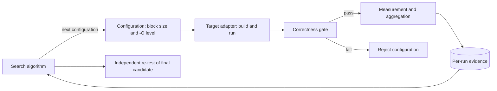

# P1: Matrix Multiplication Autotuner

学号：10245102457 
姓名：谷秉仁

> 当前版本完成 P0 基线核查。下列框架和方法部分以已验证事实填写；完整 20 组合、
> 三算法比较和最终性能分析将在后续阶段完成。本阶段数据不用于宣布最优配置。

## 1. 框架设计

Autotuner 将目标程序、离散配置空间和搜索算法分离。所有搜索算法只能通过统一
Evaluator 获取测量结果，不能直接读取未评估配置的答案。

三个接口的预定职责如下：

1. Target：编译老师提供的矩阵乘法工作副本，以统一输入运行并返回结构化结果。
2. Configuration：块大小 `{8,16,24,64,128}` 与优化级别
   `{O0,O1,O2,O3}` 的笛卡尔积。
3. Search：Grid Search 完整遍历 20 个组合；另外两种算法在后续实验中固定。

当前设计优点是正确性门禁、测量规则和搜索策略解耦，便于公平比较；代价是每个
优化级别可能需要独立构建，完整正确性与独立复测会增加总调优成本。

## 2. 源码重点与正确性基线

原程序为 C，固定 4096×4096 的行主序 double 矩阵。块循环顺序为
`ih-jh-kh-il-kl-jl`，低层循环用边界条件覆盖尾块。分块大小由命令行参数注入，
优化级别由 GCC `-O0` 到 `-O3` 注入。

原程序只计时矩阵乘法，不含初始化和输出；但使用非单调的 `gettimeofday`，时间差
返回 float，且结果 C 在计算后未被读取。后续工作副本将保留核心计算语义，同时
加入严格参数校验、单调高精度计时、固定输入和计时区外结果消费。

P0 用 n=65 的独立 `long double` 朴素 reference 逐元素检查分块结果。O0/O3 与
s=8/24/64 的 6 个案例全部通过，最大绝对误差约 `1.65e-14`；这验证了非整除尾块，
并且 O1、s=24 的 Valgrind 检查为 0 errors。这些结果不构成默认规模性能结论。

## 3. 实验环境

| 项目 | 信息 |
|---|---|
| 宿主系统 | Windows 11 家庭中文版 25H2，build 26200.9457 |
| 实验系统 | WSL2 Ubuntu 24.04 LTS，kernel 6.18.40.1-microsoft-standard-WSL2 |
| CPU | AMD Ryzen 9 7940HX，16 核 32 线程 |
| WSL 可见缓存 | L1d 512 KiB、L1i 512 KiB、L2 16 MiB、L3 32 MiB |
| 内存 | 主机 16 GB；WSL 约 7.4 GiB |
| 编译器 | GCC 13.3.0 (`/usr/bin/gcc`) |
| 电源 | Windows Turbo；交流电最小/最大处理器状态 100% |

WSL 当前缺少与内核匹配的 perf 工具；CPU 温度、可靠 governor/boost 状态和硬件
性能计数器权限未知。正式测试将重新采集后台负载和可用内存，并串行运行。

## 4. 搜索算法与公平测量方法

Grid Search 将完整评估 20 个组合。另两种算法的当前候选为无放回随机搜索和带
随机重启的离散贪心搜索；最终预算和邻域定义需在默认规模 pilot 后固定。

三种算法将使用相同输入、编译器、正确性门禁、预热、重复次数和汇总统计。报告
会把“候选程序运行时间”与“搜索总成本”分别记录；随机算法报告固定种子及跨种子
稳定性，只能使用自身已经评估的数据。每种算法的最终候选都会脱离搜索过程独立复测。

## 5. Grid Search 结果与性能差异分析

完整 20 组合实验尚未在 P0 执行。本节将在统一测量规则冻结后填写正式结果、图表，
并结合优化级别、访存局部性、循环开销、向量化与缓存工作集解释差异。

## 6. 三种搜索算法比较

三算法正式轨迹、有限预算下的结果质量、达到最佳候选所需评估次数、总调优成本和
随机种子稳定性尚未在 P0 执行。本节不使用 P0 小规模诊断耗时替代正式结论。

## 7. 复现入口

P0 的原始命令、stdout、stderr、退出码和结构化结果位于 `evidence/p0/`。当前基线
可运行 `scripts/run_p0_preexperiment.sh` 复现，并用 `scripts/verify_p0.ps1` 检查
源码哈希、证据完整性和 6 个有效案例的结果。
