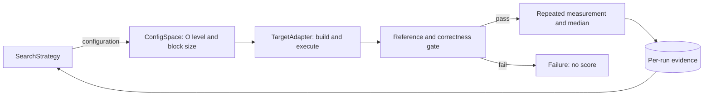

# P1: Matrix Multiplication Autotuner

学号：10245102457 
姓名：谷秉仁

> P2 已完成运行契约修复、统一测量、三策略诊断、20/20 正式 Grid 和候选独立复测，
> 等待外部审计；P3首种子比较尚未完成。当前默认C/宿主参照诊断失配，保持P3_CLOCK_BLOCKED，见8.7。
> 历史 pilot 不追认为 Grid，P2 不因开始 P3 而视为审计通过。
> 管理员处理、e0353bf/7405fcc3及内存v2恢复均保留为8.3–8.6历史记录，不移用旧证书。
> 50cd24e后唯一30区间诊断的默认忙工作有2项MONOTONIC/QPC失配，
> 内存/CPU策略及正式内容不改，不启动新recovery或目标。完整性通过不等于计时或比较通过。

## 1. 框架设计

框架把目标程序、配置空间和搜索策略分离，搜索算法只能通过统一 Evaluator 获得
自己已评估配置的结果。

`ConfigSpace` 从外部 JSON 读取 `{O0,O1,O2,O3} x {8,16,24,64,128}`；
`TargetAdapter` 负责按尺寸和优化级别构建，并把块大小作为运行参数；`Evaluator`
负责一次执行的超时、资源记录、严格输出解析、正确性门禁和证据保存；
`ConfigurationEvaluator` 负责统一的一次预热与五次独立测量。构建缓存键包含源码、
编译器完整版本、完整选项和尺寸，reference 与性能结果使用独立缓存。

优点是所有算法共享输入、正确性和测量规则，失败不能获得分数，并能分别报告目标
核心时间与调优总成本。代价是全量 reference、逐元素验证、预热和重复运行显著增加
时间与磁盘 I/O；严格资源门禁还可能推迟正式实验。

P1-R1 修复了初次提交中 `.gitignore` 误忽略 `autotuner/core.py` 的交付缺陷，并从
无 Git 元数据和字节码缓存的内容提交归档完成导入、CLI、单元测试、实际评估和小规模
正确性复验。原有默认规模 pilot 不重跑，仍按修订前诊断数据保留。

## 2. 目标程序与重点代码

老师程序是 C 语言、行主序 `double` 矩阵，默认尺寸 4096。工作副本保持
`ih-jh-kh-il-kl-jl` 分块循环和 `C += A * B` 语义，尾块用边界条件覆盖。默认
`MATRIX_N=4096`，诊断构建才覆盖尺寸；块大小严格限制为 `1 <= s <= n`。

输入由固定的 `splitmix64-interleaved-v1` 规则生成，默认种子 20261008。核心计算
用 `CLOCK_MONOTONIC` 与 `double` 计时；初始化、reference 读取、逐元素验证、结果
checksum 和输出均在计时区外。输出是单行 JSON。每个结果和 reference 元素、误差、
checksum 与时间必须有限；判据在运行前固定为
`abs_error <= 1e-12 + 1e-12 * abs(reference)`。

运行器还核对退出码0、输出schema/status、n/s/seed/input/生成规则与实际请求一致、
checked_entries=n²和容差未被放宽。退出64/65即使携带成功JSON也无分数；合法
参数拒绝和校验失败必须有相符的错误契约。预热或任一次测量失败时，不对成功子集
求中位数；构建/reference缓存可复用，但正式性能样本全部强制重新运行。

正式尺寸 reference 由独立非分块 `double i-k-j` 实现生成一次并缓存，再以 16 个
固定坐标的 `long double` 点积复核。缓存 manifest 记录输入、代码、二进制和数据哈希；
128 MiB 数据及构建产物留在 WSL 本地，不提交仓库。

## 3. 正确性验证

`n=129` 和 `n=130` 对 20 个配置全部测试，每个尺寸使用两个不同随机种子、零矩阵
和单位矩阵，共 160 次，全部通过独立逐元素 `long double` reference。两种尺寸均
覆盖分块不能整除矩阵的尾块，且 `s=128` 覆盖接近整矩阵的情况。

有限错误、结果 NaN/Inf、reference NaN、时间 NaN、checksum NaN、误差摘要 NaN
共 7 类故障均被拒绝且无性能分数。块大小 0、块大于 n、尾随字符、负种子、缺少与
多余参数共 6 类非法输入均明确分类为参数拒绝。运行器还区分崩溃、超时、编译失败、
输出解析失败、reference 失败与资源拒绝。ASan+UBSan 代表测试无诊断。

## 4. 实验环境与有限试跑

| 项目 | 信息 |
|---|---|
| 宿主 | Windows 11 家庭中文版 25H2，build 26200.9457 |
| 实验环境 | WSL2 Ubuntu 24.04 LTS，kernel 6.18.40.1-microsoft-standard-WSL2 |
| CPU | AMD Ryzen 9 7940HX，16 核 32 线程 |
| 可见内存 | Windows 约 15.22 GiB，WSL 约 7.36 GiB；可用量逐次采集 |
| WSL 缓存 | L1d 512 KiB、L1i 512 KiB、L2 16 MiB、L3 32 MiB |
| 编译器 | GCC 13.3.0，`/usr/bin/gcc` |
| 运行器 / 绘图 | WSL Python 3.12.3；Windows Python 3.12.6、matplotlib 3.10.6、numpy 2.3.3 |

默认矩阵三份约384MiB。reference文件128MiB，候选按行读取（额外行缓冲32KiB），
不再常驻分配第四个完整矩阵；文件系统缓存可能另外占用内存。试跑前功能门禁通过，但 Windows
宿主未达到预先要求的 4 GiB 正式稳定性门槛，所以以下结果仅验证成本与链路。

块大小 64、随机种子 20261008 的 `n=4096` 核心时间为：O0 `421.266406 s`、O1
`79.839050 s`、O2 `49.390784 s`、O3 `79.570400 s`。四者均逐元素匹配缓存
reference。O3 预热后五次为 `78.552165、78.081704、78.789159、80.035354、
79.960097 s`；中位数 `78.789159 s`、CV `1.10%`、相对 MAD `0.90%`。
单个块大小上 O2 较快不等于完整配置空间的最终结论。

以上是修订前P1 pilot，不是P2 Grid。P2把宿主与WSL可用内存门槛统一为2GiB，
根目录至少1GiB，宿主CPU五次采样平均≤10%、单次≤20%。依据是候选实际峰值
RSS约386MiB及reference生成的约384MiB需求；该门槛及全部测量规则在正式运行前
冻结。每配置开始前重新检查门禁，运行期间保留宿主内存/提交量/分页和WSL
swap、vmstat、memory PSI样本；宿主和WSL的可用内存分别判断，不互相替代。

WSL 缺少匹配内核的 `perf` 工具，CPU 温度、可靠的 governor/boost 状态与硬件性能
计数器数据未知。因此目前只能依据时间和算法/访存结构提出机制假设，不能把它们写成
已经由硬件计数器证明的事实。

## 5. 搜索与公平测量方法

正式协议为串行运行、同一输入、正确性先行、每配置一次预热和五次测量，以核心时间
中位数计分；任一次失败则配置无效。O0/O1/O2/O3 超时分别固定为
`1271/244/151/243 s`。候选时间与构建、reference、验证、墙钟和总搜索成本分开。

Grid 以优化级别为外层、块大小为内层遍历全部 20 个配置。无放回随机搜索对 20 个
配置做种子化 Fisher--Yates 排列。随机重启贪心每次只改变一个参数到任意其他合法
值，每点共有 3 个优化级别邻居和 4 个块大小邻居；只接受严格改善，无改善或邻居
用尽则从未评估配置重启。预算为 4、8、12，
4/8 是同一条 12 次轨迹的前缀；初始五个种子为 20261008--20261012。算法只能读取
自身已评估数据，最终候选必须独立复测。

完整 20 配置 Grid 的最优有效结果作为后续算法质量参照。若同时报告 Grid 的
4/8/12 配置前缀，必须注明固定遍历顺序及其可能引入的前缀偏置。该规则在任何正式
搜索开始前由 P1-R1 修订并版本化。

原先约 6 小时是初始估计，不是完成承诺。根据本次完整 Grid 的配置评估墙钟累计
20088.175 s，均摊约 1004.409 s/配置，每种随机算法五种子各 12 配置约需
60264.524 s（16.74 h）；两种约 33.48 h，另加资源等待、失败、setup 和候选复测。
这是当前配置均摊成本的条件估计，不保证随机轨迹的配置组成相同，也不是已校准物理时间。
P3 建议先完成一个种子的 12 次轨迹、核查实际成本，再分批覆盖五种子；4/8 的前缀
不增加评估预算。上述估计来自 P2；用户随后授权启动 P3，精确预算与分批规则见
[`P3_PROTOCOL`](docs/P3_PROTOCOL.md)。P3 实际数据尚待运行，不用估计填报结果。

## 6. P2 正式完整 Grid

正式内容提交为`0d3dd5242c728d8001dd02a4e332185459d04721`，n=4096、random输入、
种子20261008，输入生成规则及乘法循环不变。规范顺序为O0/O1/O2/O3外层、
s=8/16/24/64/128内层。20个唯一配置全部有效：20次预热、100次独立测量；
每次退出0、finite检查通过、逐元素校验16777216项、零错配，max_abs_error=0。
独立reference的16个long double采样全部通过（最大绝对误差约3.96e-12、相对
误差约3.95e-15，符合预设判据）；并非声称对4096做了全矩阵long double计算。

### 6.1 核心时间与独立复测

下表是各配置五次新测量的中位数，单位为该环境的CLOCK_MONOTONIC秒，预热不计分。
完整精度及均值、样本标准差、CV、MAD、进程墙钟在
[`grid_summary.csv`](evidence/p2/grid-session-0d3dd52/grid_summary.csv)。

| 优化级别 / s | 8 | 16 | 24 | 64 | 128 |
|---|---:|---:|---:|---:|---:|
| O0 | 405.629870 | 470.839455 | 464.997551 | 443.647464 | 438.329346 |
| O1 | 97.132775 | 79.445990 | 65.389033 | 55.128554 | 53.444628 |
| O2 | 102.174544 | 81.886364 | 69.050234 | 55.687057 | 54.505498 |
| O3 | 99.538986 | 84.761687 | 71.655194 | 56.542559 | 54.995413 |

本会话**测得最低中位数**为O1/s=128。Grid五次为53.710804139、53.687048943、
53.301665681、53.444627760、51.281525509 s；独立组重新预热后五次为
54.779446389、55.174462139、54.467224360、56.161193077、54.074720667 s。
两组均使用相同输入、reference与协议，全部force_remeasure=true；复测不改原Grid表。

| O1/s=128 | 中位数(s) | 均值(s) | 样本标准差(s) | CV | MAD(s) |
|---|---:|---:|---:|---:|---:|
| Grid | 53.444627760 | 53.085134406 | 1.022605745 | 1.9264% | 0.242421183 |
| 独立复测 | 54.779446389 | 54.931409326 | 0.797483326 | 1.4518% | 0.395015750 |

独立复测中位数高2.4976%，大于O1与O2在s=128的原表差距1.9850%，但小于O1与O3
的差距2.9017%。原先笼统“大于O2/O3差距”的表述有误。复测与时钟/资源限制仍不足
以断言O1是稳定环境下的真正最优优化级别。20组CV范围为0.1441%--4.7865%，最高为O3/s=16。
下图保留100个计分样本，不删除较慢值；预热、复测及中断部分不混入图中。

### 6.2 成本、暂停与完整性

UTC时间戳从2026-10-08 15:26:07至2026-10-09 00:14:46（UTC+8），跨度约
8 h 48 min 39 s，包含用户低电量关机暂停。UTC曾调整，此跨度与单调计时成本
不是同一时钟域；不得相减来声称精确的暂停或缺失成本。

| 成本项 | 记录秒数 | 范围 |
|---|---:|---|
| 活动会话 | 23908.150 | 约6 h 38 min 28 s；含门禁/等待，不含未落检查点的关机前间隔 |
| 资源门禁/等待 | 2153.500 | 约35 min 54 s；活动会话的子项 |
| 四级候选构建setup | 2.988 | setup阶段实际编译 |
| reference setup | 35.092 | 含reference构建/生成/身份核查；生成核心33.247 s |
| 完整Grid配置评估 | 20088.175 | 20组的统一接口墙钟；不含启动门禁等待 |
| 完整Grid目标进程 | 19997.806 | 上项中的120个进程；核心19840.530 s、验证85.124 s |
| 独立复测配置评估 | 338.596 | 另组1预热+5测量；目标进程334.462 s |
| 全部完整目标进程 | 21605.941 | 129条，含3条放弃记录；核心21434.372 s、验证93.152 s |
| 放弃的完整目标进程 | 1273.673 | 原O0/s16的3条部分执行，不计分 |
| 无完整结果的中断进程 | ≥325 | 最后观察到的进程耗时下界，最终退出及精确成本未知 |

各项有包含关系，不能全部相加。每次build/reference查找另计0.181/26.252 s，包含
在配置评估中；大型缓存留在WSL。旧grid-main的SIGPIPE执行和其reference成本单独
保留，未拼入当前session。暂停后原O0/s16整组重新预热和测量，无性能缓存样本。
证据审计复算所有统计量并核对唯一ID、原始输出、退出码、门禁与哈希，完整性PASS：
120条Grid+6条复测+3条放弃完整记录，另1条无完整结果的中断执行。
[`成本与资源审计`](evidence/p2/grid-session-0d3dd52/evidence_audit.json)、
[`后处理命令及哈希`](evidence/p2/postprocessing/summary.json)。

### 6.3 资源与解释限制

70次正式门禁记录中24次PASS，失败期间暂停启动新增配置；运行中只采集，不按事后
门槛筛选成功子集。129个完整进程峰值RSS最多394856 KiB（385.60 MiB），逐进程
major fault全部0。WSL运行中最低可用内存约3.37 GiB、swap使用与pswpin/pswpout均0；
这不代表宿主无压力。718个宿主快照有197个低于2 GiB，41个CPU超过20%，最低可用
约99.5 MiB，CPU峰值62%；系统提交百分比最高65%，pages/sec与page_reads/sec
最高116140/60201。它们是全系统指标，不可直接归因于候选。

23:49只读快照记录游戏进程工作集约2.76 GiB和宿主内存不足；用户后续表示自行关闭
高负载应用并继续。资源恢复后门禁才允许后续组启动；主控未关闭应用或改系统设置。
游戏、监控、日志/Git操作、关机及充电变化的独立扰动没有量化，不能声称运行环境
全程静止。CPU平均10%/单次20%是启动前背景负载的本项目质量条件，不限制目标
进程；温度、节流、可靠boost状态、硬件计数器与压缩内存仍未知。

时钟探针发现REALTIME跳变及MONOTONIC/RAW间隔差异，直接syscall未证实可消除
差异；没有独立物理时间校准。所有分数保持冻结计时源原样，不校准、不丢弃样本。
绝对秒数和小幅排序需谨慎解释。见[`P2_TIMING_NOTE`](docs/P2_TIMING_NOTE.md)。
审计PASS证明记录/契约/完整性一致，不证明背景资源或跨宿主计时精度稳定。

### 6.4 性能机制与后续比较边界

已测事实：O1/O2/O3均显著快于O0；优化档中块大小增大时本次中位数下降，而O0
最小值在s=8；更高优化级别没有保证更低时间。源码的内层j对行主序B、C连续访问。
循环控制开销、分块后的局部性、编译优化改变指令及寄存器利用是候选解释，尚没有
汇编或硬件计数器证据验证因果关系。安装编译器的`gcc -Q -O[level] --help=optimizers`
显示O0/O1关闭tree loop/SLP vectorize，O2/O3开启；O2代价模型very-cheap、O3为
dynamic。这仅说明选项启用，不证明该矩阵循环实际向量化，也不能解释O1胜出。
[`编译器原始输出`](evidence/p2/environment/memory_pause_tools_20261008.json)。

作为后续参照，规范Grid前4/8/12配置的最低中位数分别为405.629870345、
65.389032579、53.444627760 s，相对完整表最低值高658.9722%、22.3491%、0%。
这是固定遍历顺序的前缀偏置，不是随机或贪心搜索结果。后续策略不得读取本表来
作决策；完整Grid只在轨迹结束后用于质量比较。正式随机/贪心跨种子结果待P3，
时钟/背景扰动是否要求新环境新session复测，先交外部审计者裁决。

## 7. P3：正式搜索比较（首种子时钟阻塞，暂无完整结论）

P3内容提交 `e308bfb873e6811c50ad685a979af345302fda8d`，新增campaign运行与独立
后处理，不改变P2 C/core/measurement/search源码、输入、容差或核心计时。搜索
schema 2保持不变，campaign schema 1在P3正式分数出现前冻结种子次序、预算前缀
与复测方式，规范化哈希为`bf7e5fd63656c6bb68714cffd8a060bac8e17db15138ef1b88e8b59b6d5c7461`。

无放回随机与七邻居重启贪心各运行五个冻结种子，每轨迹12次唯一配置，4/8作为前缀。
首批先跑20261008的两条轨迹；各预算不同候选各独立复测，复测不反馈策略。
策略不读取Grid或其他轨迹；恢复只重放自身有序观测。完整P2表只用于后处理评价
配置选择，相对P2的跨session时间差另列，不能把负时间差解释为真正全局最优。

干净归档没有.git或初始pycache，移除PYTHONPATH：40项单测、n17/O2/s8 fresh正确
通过；n130十轨迹共120次配置、720次搜索+114次独立复测=834次新执行通过。
另实际验证一条部分样本暂停，恢复后放弃旧组并完整重新测量；完成批次恢复不新增
目标执行。这些是链路诊断，不是n4096算法质量数据，不能据此声称搜索优劣。
证据与续跑见[P3审计入口](docs/P3_AUDIT_HANDOFF.md)。P3正式预算表与五种子稳定性
尚待批次完成后填写，继承P2时钟未校准与资源非平稳的限制。

首批01:42快照仅完成1/24配置：O1/s64中位数54.993200129秒、CV1.2048%，六次
全矩阵通过。O0/s24只有预热通过，不产生分数；不能把这个快照当作4/8/12预算的
算法比较或完整P3结论。完整计划仍为两算法各五种子、总120次轨迹内去重配置评估。

后续进度：O0/s24完整五次测量中位数467.876385448秒、均值467.706472674秒、
样本标准差1.7528160454秒、CV0.3748%、MAD1.201713070秒；全部六次全矩阵通过。
首批已完成2/24配置、共12条目标执行；02:24在第三配置前的16次资源门禁均失败后
保存检查点并退出。10:12复查宿主最低可用内存约433MiB，CPU平均4.4%/最大12%，
WSL可用约3.87GiB、swap使用0。限制是宿主内存，未放宽门槛或停止其他应用。
尚无任何完整4/8/12预算前缀或正式候选复测，不能填报算法质量比较。
[暂停后的原始一致性复核](evidence/p3/resource-paused-audit/audit.json)和
[带时间资源复查](evidence/p3/environment/terminal_gate_20261009_101207.json)。

10:40资源门禁恢复PASS（宿主5.70GiB、WSL3.90GiB，CPU平均4.4%/最大16%），
沿用原内容提交和session续跑，完整旧组原样保留。10:42:55第三配置O3/s16开始预热；
[恢复验证](evidence/p3/resume-20261009-104020/restoration.json)只证明身份和恢复链路，
不构成新配置分数或搜索比较结论。历史暂停数据与环境限制不删除、不事后筛样本。

本次0023ceed审计修订后，P3安全暂停于3完整配置/21条目标执行，含O0/s8部分组3条
不计分；正式比较尚未完成。前缀成本只限终态配置评估调用，跨暂停失败门禁/放弃
样本/setup/复测/离线间隔不包含在该前缀指标内，不能称完整端到端成本。
[成本定义及暂停—恢复回归](docs/P3_COST_SCOPE.md)、[本轮先验诊断判据](docs/P3_TIMING_AUDIT.md)。
### 7.1 0023ceed独立审计复测（不计入正式搜索）

内容提交`0d57f8c53a14a8c1d02dfd91263b038fac710ee4`，主控v3与WSL双干净归档，
保留原C核心/计时/测量schema 2，新独立诊断session。反序交错O1→O2→O3、
O3→O2→O1，各组独立1预热+5fresh。36次全部退出0且逐元素16777216项通过。

| s=128配置 | 第一轮中位数 s | 第二轮中位数 s | 跨轮变化 |
|---|---:|---:|---:|
| O1 | 50.963140880 | 51.435436694 | +0.9267% |
| O2 | 52.042876327 | 52.626460105 | +1.1214% |
| O3 | 51.308399075 | 52.122370106 | +1.5864% |

两轮观察排序O1<O3<O2与P2的O2/O3顺序不同。组CV约0.70%--1.43%，跨轮变化
未越先验2%警告，但全部相邻差距仅0.68%--1.43%，且宿主低内存/一次21%CPU
触发资源警告，所以先验稳定排序判据为false，不宣称稳定最优。时间顺序、暂停
间隔、背景压力和频率/温度是候选影响因素，没有因果验证。

前后各3个20s探针、六个整组与36个Evaluator区间的MONO/RAW/宿主对照按预声明
各自判据通过；不是RAW核心时间或独立物理校准，不能用单一比例修正旧Grid/P3。
WSL最低可用3.48GiB、swap用量0，宿主最低1.83GiB；峰值目标RSS385.60MiB。
主控主循环39分29秒含门禁采集/等待280.44s、setup、探针、六组和分析；各层级
成本不相加。资源门禁5次失败后均恢复，不筛掉任何成功目标样本。
[先验判据/详细统计/原始入口](docs/P3_TIMING_AUDIT.md)、
[完整分析](evidence/p3_audit_0023ceed/session-0d57f8c/analysis.json)。
诊断不输入搜索策略，不改原Grid或历史pilot；该轮审计结束时P3保持暂停。

### 7.2 e46b96c 后首种子正式恢复

本次用户明确授权沿用原e308bfb归档、固定Git身份及原campaign，只完成
seed=20261008的随机/贪心各12配置及4/8/12前缀候选独立复测，完成后先评审，
不自动启动后四种子。原3个完整配置与21条原始执行保持不变；O0/s8旧3条部分
样本留作放弃记录，新attempt重新完成1预热+5测量，不补齐旧组。

[本次主控](evidence/p3/first-seed-e46b96c-20261009/controller.json)记录实际原归档
命令和退出状态；批次前后短时钟检查各用独立文件，不改核心计时、不校准旧时间。
14:04批前3×3秒检查通过，setup门禁曾因宿主可用内存不足2GiB拒绝，随后恢复。
14:22按新增暂停请求安全停止：新增O0/s8预热448.537238087秒、首测446.074163641秒
均全矩阵通过，但组未完整、不计分；累计3个完整配置、23条执行（18条完整组+5条
部分组），尚无4/8/12正式前缀或候选复测。该批结束时钟检查也通过，原始记录不改写。

16:38用户要求继续；修复后台Windows PS模块路径后，16:42批前时钟检查出现
MONO=3.001954764、RAW=2.966602491秒，差35.352毫秒，超过预声明34.666毫秒限值。
随后边界检查也失败，未恢复campaign。先声明一次10×3秒的限定复核，结果5/10
MONO/RAW区间失败，保留全部读数并停止新增正式测量，不探测到“偶然通过”为止。
16:56正式资源复查PASS（宿主2.76GiB、WSL3.93GiB、CPU平均5%/最高7%），不解除
时钟阻塞。tsc/NTP同步状态不能证明物理时钟精度；根因尚未确认，未调系统参数、
更换计时源或校准历史时间。[状态及原始证据](docs/P3_FIRST_SEED_STATUS.md)。

当前原campaign活动成本7120.755秒，其中门禁/等待1165.348秒；3个终态搜索评估
调用3668.359秒、5条未计分执行的进程耗时2236.427秒，独立复测成本0。它们有包含
关系，不相加；活动成本不含离线暂停，新恢复前的时钟诊断/复查也不混入该成本。
成本继续使用[原前缀范围](docs/P3_COST_SCOPE.md)，另列整个campaign累计活动成本，
不把前缀、复测、活动会话等有包含关系的时间相加。

## 8. 复现入口

快速检查运行 `python3 scripts/verify_p1.py` 和
`python3 -m unittest discover -s tests -v`。结构化摘要位于
`evidence/p1/correctness/summary.json` 与 `evidence/p1/pilots/summary.json`，完整
逐次记录分别位于同目录 JSONL 文件。测量与搜索冻结规则位于 `configs/`。

P2阶段干净归档回归在`evidence/p2/validation-final/`：31项单测、160个正确性案例、
7类故障和6类非法参数通过；n=130实际Grid20/随机8/贪心8均通过统一配置接口。
提交后的交付归档复验另存`evidence/p2/validation-delivery/`，内容提交
`c2a964162915b8cf0019df4e73bcd7cd634d1902`的同一套回归全部PASS，独立空缓存
n17 fresh及n130三策略20/8/8通过，20个Python文件AST和已提交正式证据审计通过。
这不改正式实验身份。正式续跑、身份核验及完整证据审计命令见README。
策略诊断不构成正式算法质量比较。报告图片均为仓库相对路径。

首种子时钟阻塞后的交付内容`f64d41c1eab21c72e541f91ab7e2dbecf4adfe2b`也从
独立归档验证：CLI/20配置、53项单测、历史证据核验及文件身份检查整体通过。
[新证据](evidence/p3/first-seed-clean-f64d41c/summary.json)明确正式比较未完成；
这不是重跑4096、完整Grid或两条P3轨迹，不替换正式实验e308bfb身份。

### 8.1 fdeed77 后辅助验收修复

本轮统一时钟检查、操作/检查点绑定与验收状态，正式实现和测量协议不变。
schema、整数纳秒端点、保存delta及来源哈希均严格复算，不直接信任保存pass；
Windows入口及异常拒绝使用合成回归验证。辅助内容0c6ee7e双归档全套71项测试
（WSL跳过1项）及Windows专用回归通过；仅证明检查/拒绝链路，不表示算法比较完成。

18:39–18:41唯一复核A/B各10×3秒全部保留。MONO/RAW 20/20失败，绝对差
96.361–157.728ms，允许差33.442–34.140ms；REALTIME/RAW 2/20失败。
Windows同一次调用UTC/QPC两窗口均通过，不能把其调用全过程与WSL内部sleep
总和混为同一区间，更不能据此比例校准旧数据。原探针均退出0，但检查据实拒绝。
本次门禁宿主最低1.968GiB低于2GiB，CPU均值7.4%/最高12%，WSL可用4.690GiB。
两个REALTIME异常、tsc/NTP/启动及事件原始信息保留，根因尚未证实。

复核还发现辅助清单误将后来新增判据文件定位到原e308bfb归档，原identity检查
失败记录不改。v2.1仅修正辅助位置并增加回归；补充32项正确位置哈希一致，不
授权恢复，不重采时钟，不修改原归档/C/正式协议。当前仍3完整配置/23条执行，
两条轨迹、六行前缀和独立复测未完成。本轮新增正式执行/成本为0；唯一次复核
入口QPC93.366197s单列，内部资源/哈希/探针为嵌套子范围，不能全部相加。
设计、迁移、证据与下一步限制见[辅助契约v2.1](docs/P3_CLOCK_CONTRACT.md)及
[全部复核分析](evidence/p3_clock_contract/20261009-180810-0491a4ec/clock_review_analysis.json)。

最终辅助内容`fa597017c2317772a0f7f34faa75194ffecec8f2`双干净归档74项单测
（WSL跳过1项）、Windows旧7/新21项、CLI/20配置和源码身份检查通过，包含恢复-only
不能代替真实campaign边界的回归；[验证摘要](evidence/p3_clock_contract/20261009-180810-0491a4ec/clean-fa59701/summary.json)。
此处PASS仅指辅助实现/历史未完成模式，当前复核原始身份拒绝及计时失败仍保留。
19:01的新门禁CPU平均12.8%再次拒绝，不能混成18:40快照。只读w32tm显示Windows
未同步、WSL另报告同步，根因仍unknown；未更换计时源或校准历史数据。
最终正式进程为空，10个初始保护文件字节未变；已记录独立辅助QPC627.847147s
不含后续推送及未记录编辑开销，不能与原campaign或嵌套子成本相加。

### 8.2 10-10集中环境诊断（没有新增性能样本）

Windows W32Time正在运行但Leap=3未同步，source/configuration查询返回0x80070005，
当前进程没有管理员权限，故未实施同步。宿主正式门禁可用内存最低422170624字节
（约403MiB），不足2GiB；CPU平均2.8%/最高13%、WSL可用4913426432字节及swap0
不解除宿主内存限制。新recovery、resume和矩阵执行均为0，不把未执行写成PASS。

只读adjtimex显式modes=0：freq=-1816586，按freq/65536为-27.718902587891ppm；
tick=10020us，status=8192（STA_NANO）、offset=0ns、maxerror/esterror=0us。
这些是当前内核状态而非物理时间精度。WSL timesyncd报告同步，但同时有秒级offset/
较大jitter；Windows历史事件有成功同步与之后DNS失败，本次DNS解析另成功。
频率调整、同步及虚拟化时钟可能相关，但缺少旧区间同期状态，异常根因尚未证实。

旧20条原始整数端点复算仍20个MONO/RAW及2个REALTIME/RAW失败；宿主同调用
UTC/QPC均通过，范围不同不能与WSL内部区间直接相等比较。保留全部原数据及旧
身份失败，不比例校准Grid/P3、不反馈策略。WSL/内核/编译器版本与源码SHA未变，
但宿主/WSL启动状态变化单独记录，不据此声称环境已稳定。

10213个历史/实现文件及原检查点、23个run_id不变，32项冻结文件实际SHA一致。
28项针对性回归、CLI和20唯一配置通过，仅认证辅助链路。新诊断完整性true；
实验完成、时钟认证和比较就绪均false（新时钟复核未执行）。原campaign活动
7120.754915s、门禁/等待1165.348475s、终态配置调用3668.358619s、部分执行进程
2236.427057s、复测0，本轮正式成本增量0；各范围嵌套不相加。

截至独立分析，辅助命令QPC区间并集200.514293s（并行区间只计一次），分析本身
10.968886s及后续核验另列，不包含完整编辑/离线/推送成本。详细证据、限制和
需要的前置处理见[集中诊断](docs/P3_CLOCK_REPAIR.md)及
[本批原始后处理](evidence/p3_clock_repair/20261010-121004/diagnosis_analysis.json)。

### 8.3 10-10管理员处理核验（13:56，无新增性能样本）

管理员13:52日志保存了既有NTP配置/源/peers，仍time.windows.com,0x9。resync有执行
输出但明确报告无可用时间数据；日志的退出码0来源不充分，与该消息冲突，不认定
同步成功。操作后及13:56可靠退出0的状态查询仍Leap=3/stratum=0、最后同步错误1。
“上次成功同步时间”更新也不能替代状态核验。网络/服务/虚拟化根因仍未证实，
本轮未再次同步或修改任何系统设置，原始日志包括原有NUL均按字节保留。

一次原Formal门禁显示内存恢复：宿主最低2724028416字节（2.537GiB），WSL可用
6215512064字节（5.789GiB），swap使用0，根盘空闲223818285056字节；CPU采样
13/9/16/18/15%，均值14.2%超10%门槛，最大18%通过20%。门禁REJECT/退出2，
不得重复采样至通过，recovery/resume/正式执行均未启动。本次没有新20区间数据；
旧数据时钟/资源限制与8.2所述历史失败继续披露，不进行比例校准或反馈搜索策略。

冻结32项实际SHA和fa59701辅助七文件一致；检查点、23条执行/ID、完整观测及
部分组保护核验通过，random仍3/12、greedy0/12，独立复测和六行预算表尚未产生。
独立验收true/false/false/false仅第一项认证本批证据，时钟状态为未执行而非通过。
没有正式进程；所有正式成本本轮增量0。前置门禁QPC33.7389714s计入本轮辅助成本，
不追加原campaign.wait；历史成本包含关系不变，完整端到端前缀成本仍unknown。
辅助成本截止范围和一次性后处理的局部失败/修正均单独留档，没有重跑28项回归。

[管理员处理与资源说明](docs/P3_CLOCK_REPAIR.md)、
[本批独立验收](evidence/p3_clock_repair/20261010-135557/independent_acceptance.json)、
[原始管理员日志](evidence/p3_clock_repair/admin-20261010-135245/admin-session.txt)。

### 8.4 历史：10-10 用户授权的资源准入迁移及e0353bf失败

本项目质量门槛（非老师要求）修订为 Recovery CPU 超过旧10%/20%仅警告，Formal
五次原始采样均值≤30%/最高≤60%；Windows/WSL可用内存各≥2GiB、根盘≥1GiB不变。
它只约束配置开始前的背景负载，不限制目标程序自身CPU。配置门禁等待含采集最多120秒。
PowerShell、Python、主控/运行器/后处理共用版本化策略；旧v2数据按原策略保留。

因运行器/协议哈希变化，正式归档和 session 重新建立，从空观测开始；旧3配置/23执行及
部分组封存，不拼入新分数。C、搜索、输入、容差、预热/重复、中位数及核心计时源不变。
新成绩不追认旧Grid已校准；旧O1/s128仅是带限制的历史最低中位数，不是新策略全局最优证明。
新比较只在一次20区间 recovery、来源和新Formal门禁全通过后启动首种子两条轨迹。
本轮唯一recovery的20个MONO/RAW、20个REALTIME/RAW及两次Windows同调用检查均通过；
Formal启动门禁CPU均值11%（超过旧10%但符合新30%）也通过。随后批前/批后各3区间
通过，但e0353bf campaign内部UNC资源脚本签名拒绝，加上中文stderr解码异常/未赋值
异常分支导致退出1。**0次4096执行、0配置、0/2轨迹、0候选复测**，不能给出6行比较。

恢复基线原有的子进程启动参数（不改系统/组织执行策略），资源错误保留二进制原字节
及可靠退出码；最终内容7405fcc的双干净归档测试及n17 fresh链路通过，实际UNC入口
合成重放通过。因源码身份改变，建立新空session3768a29ade69408da4c5d0c4404ba44e，
不迁入旧成绩或旧恢复证明。本轮一次recovery额度已用，不擅自再次采集。

e0353bf实际失败调用的四项独立验收为true/false/true/false；修复后的空session为
true/false/false/false，时钟及正式门禁未执行，不是采样失败。新探针通过不解释旧异常
根因，也不校准旧Grid/P3。[资源迁移说明](docs/P3_RESOURCE_POLICY.md)给出完整来源、
失败及修复、新身份和下一轮命令。正式比较仍未完成，保留CV/MAD与资源警告的既有规则。

### 8.5 历史：10-10 7405fcc3首种子有限恢复（16:15，资源拒绝）

交付基点b19e6cd；实际内容7405fcc37074ab815294ba401d5cf5e8280f3d5f，既有session
3768a29ade69408da4c5d0c4404ba44e不变，未重建或导入旧e308bfb/e0353bf成绩。
50项运行来源哈希通过；新授权的唯一recovery入口退出2，宿主可用内存最低775036928
bytes（0.722GiB）不足2GiB。CPU五次17/5/13/27/11%，均值14.6%/最高27%，按Recovery
策略仅警告；WSL内存5.782GiB和根盘208.312GiB通过。拒绝原因是host_memory，不是CPU。

A/B20区间没有采集，宿主同调用检查/Formal门禁/正式搜索未执行；不循环恢复到通过。
新配置0/24、轨迹0/2、原始目标执行0、复测0，无六行预算结果或可报告的CV/MAD。
既有审计器要求完整两窗口，故四验收项均false；不能把未执行写成时钟实测失败，
也不能把此完整性false写成源码损坏。已采集操作哈希及10357项历史保护核验通过。
16:18另一只读OS快照可用内存7.768GiB，不同时/不同API，原因未知，不能替代门禁。

新campaign仍initialized，活动累计仅既有初始化0.080059216秒，本轮正式/放弃/复测/
campaign等待增量全0。已捕获辅助操作并集118.069225秒，包含Recovery入口60.009010秒
及其内门禁34.475277秒，嵌套成本不相加，不含未计量编辑/哈希/推送等。
源码和评分未改，历史Grid继续仅为带限制的参考，不是新条件下的全局最优证明。
详见[本轮结论与原始证据入口](docs/P3_FIRST_SEED_7405FCC3.md)。

### 8.6 10-10 内存准入v2与一次有限恢复（历史，无正式性能新增）

用户授权修订的是实验质量策略，不是老师规定的硬件要求。宿主可用内存低于2GiB
改为警告；五次可用内存最低值和五次提交余量最低值各≥512MiB。提交余量为
CommitLimit−CommittedBytes，严格校验有效正整数计数及范围。Recovery WSL至少
256MiB，Formal仍2GiB；根盘1GiB、CPU规则、120秒总等待不变。Windows可用、提交
余量和WSL内部容量分别判定，不能相加Vmmem工作集；分页计数保留而不事后筛选。

同窗口资源入口保留五个宿主/提交/分页样本、另一OS内存接口、Vmmem与完整meminfo。
17:55最低host434728960 bytes不足新512MiB，REJECT不改写；18:06唯一recovery自己
采得host3927523328、提交余量26103156736、WSL6210179072 bytes，PASS，CPU24.2%/
31%仅警告。两窗口内存变化原因未确认，没有冷启动前证据，WSL预占或回收仅是未证实
的解释。WSL swap均未使用，但宿主分页读数非零；资源准入通过不能证明稳定性能。

主要三块double数组约384MiB，是候选/reference各自的主要数据估算；它不包含Python、
编译器、内核、服务和文件缓存，不是整机精确峰值。reference生成和候选按顺序运行，
Python父进程仍驻留。n17实测RSS1636KiB不能外推为4096峰值。

新运行内容d6811cadda8ecd7b46225ebe65c51831278694a0、新session
2c270825458a4857a5ac9df5aadf597b从空观测开始，C/输入/计时/容差/1+5fresh中位数/搜索
不变。干净归档28项相关单测（1跳过）、CLI/20配置及n17/289元素通过；旧成绩不迁移。
唯一20区间recovery的MONOTONIC/RAW有6项超原容差，REALTIME/RAW20项和宿主同调用
两项通过。来源与证据完整性true，计时false，执行未完成、比较未就绪；停止而不再重试。
Formal门禁未执行，4096执行0、配置0/24、轨迹0/2、复测0，没有六行预算比较或新CV/MAD。
新结果不校准历史Grid/P3、不反馈搜索策略，不声称新条件下的20配置全局最优。

10456项历史原字节保护通过，新检查点仍initialized，无正式进程。辅助捕获操作并集
376.655117秒仅限已声明范围，含recovery入口127.450873秒；内部资源35.582438秒和
两窗61.440254秒属于子范围，不相加。新campaign活动0.100855773秒仅初始化，正式、
复测、放弃与Formal等待各0。未包裹编辑/哈希、finalize父调用及推送等另在范围外，
完整端到端成本unknown。详见[资源策略与全部失败区间](docs/P3_MEMORY_POLICY.md)、
[实际独立验收](evidence/p3_memory_policy/20261010-174802-11f7775c/independent_recovery.json)和
[成本原始范围](evidence/p3_memory_policy/20261010-174802-11f7775c/costs.json)。

### 8.7 10-10 原生C与宿主QPC有界参照诊断（当前）

先声明方案并提交源码7950a8a533f5c60dd8fb7a0d26cb90a3e3d2b32d，再编译和保存manifest，
一次固定顺序执行A默认空闲10、B默认忙工作10、C直接syscall空闲5、D默认临时绑核空闲5。
一个持续WSL原生进程按序号flush响应；Windows QPC在每个起/终读取请求前后取整数端点。
宿主参照为[L,U]时长边界，非WSL启动全过程或名义sleep时长。不确定性≤20ms、允许差
5ms+1%U，全部样本保存、不替换。这是项目拟议跨域一致性标准，非物理精度保证。

30区间/96响应完整、来源和端点复算通过，无回退或无法判定。最大通信不确定性1.2861ms、
最大读取跨度2326ns。默认MONOTONIC在A10/10、B8/10匹配宿主；C/D空闲各5/5。
RAW30/30匹配宿主，两条失败的REALTIME/BOOTTIME也不匹配宿主；彼此一致不是准确性证明。

| 失败区间（零起点） | QPC[L,U]秒 | MONOTONIC范围秒 | RAW秒 |
|---|---|---|---:|
| B1 | [2.920034100,2.920943400] | [3.001507735,3.001508090] | 2.920459798 |
| B2 | [2.834922100,2.835973300] | [3.001663284,3.001663628] | 2.835416878 |

最小MONO分别超过U+a约46.355ms、132.330ms。第二条两端CPU均17，因此不能把记录到的
跨端点迁移当作必要条件；区间内调度未连续捕获。C/D与B的负载及时间不同，不能以它们
通过证明syscall/绑核能够修复默认忙工作问题。只读adjtimex modes0、freq0ppm、
timesyncd已同步与内核tsc消息是环境观测，不证明底层原因，原因仍unknown。

按预声明第3项保持P3_CLOCK_BLOCKED。没有改资源v2、C、计时/搜索/计分或正式协议，
没有新session、recovery或4096；正式d6811cad/session2c270825458a4857a5ac9df5aadf597b
保持initialized且无观测。完整性true、参考匹配false、计时false、执行未完成、比较未就绪。
正式配置0/24、轨迹0/2、前缀0/6、复测0；没有新增性能分数、CV/MAD或算法优劣结论。
旧6/20仍失败，历史Grid/P3未按比例校准，也不是新条件的同协议比较基线。

11项相关回归、准确内容干净复验、CLI/20配置与探针二进制复编SHA通过；10623项历史原字节
和51项正式归档、旧23条执行及暂停标记保护通过，无实验进程。首次辅助Windows配置列表
失败及包装器退出码问题保留，收尾助手改为可靠转交子退出并用退出7负控验证；没有改采集
源码或补采。首轮4个辅助包装器另有退出后日志写入的流哈希竞态，原记录全部明确拒绝、
保留不改写；完整性true限实际诊断/历史保护及可靠v2验证，不认证这4条辅助失败记录。
真实30区间包含全部失败，没有筛选。诊断入口91.6706073秒包含采集90.9342755秒和其中原生90.1953194秒，不相加。
非嵌套已捕获辅助234.2932793秒、摘要父另2.6291969秒，正式各项成本本轮增量0；
编辑/后续核验/推送不在该统计内，完整端到端unknown。详见
[方案/实际环境/决策及复算命令](docs/P3_CLOCK_REFERENCE.md)、
[独立30区间复算](evidence/p3_clock_reference/20261010-190645-1375f246/independent_diagnostic.json)、
[成本范围](evidence/p3_clock_reference/20261010-190645-1375f246/costs.json)。本轮停止等待外审。
