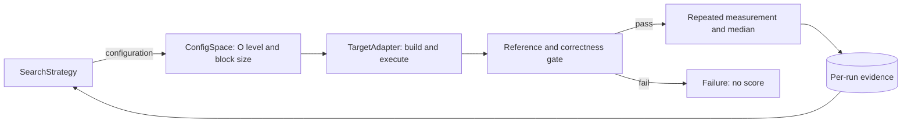

# P1: Matrix Multiplication Autotuner

学号：10245102457 
姓名：谷秉仁

> 当前完成正确性与统一测量基础。完整 Grid、另外两种算法和正式最优结果将在后续
> 阶段补充；本节明确标注的有限试跑不用于宣布最优配置。

## 1. 框架设计

框架把目标程序、配置空间和搜索策略分离，搜索算法只能通过统一 Evaluator 获得
自己已评估配置的结果。

`ConfigSpace` 从外部 JSON 读取 `{O0,O1,O2,O3} x {8,16,24,64,128}`；
`TargetAdapter` 负责按尺寸和优化级别构建，并把块大小作为运行参数；`Evaluator`
统一执行超时、资源记录、严格输出解析、正确性门禁和证据保存。构建缓存键包含源码、
编译器完整版本、完整选项和尺寸，reference 与性能结果使用独立缓存。

优点是所有算法共享输入、正确性和测量规则，失败不能获得分数，并能分别报告目标
核心时间与调优总成本。代价是全量 reference、逐元素验证、预热和重复运行显著增加
时间与磁盘 I/O；严格资源门禁还可能推迟正式实验。

P1-R1 修复了初次提交中 `.gitignore` 误忽略 `autotuner/core.py` 的交付缺陷，并从
无 Git 元数据和字节码缓存的内容提交归档完成导入、CLI、单元测试、实际评估和小规模
正确性复验。原有默认规模 pilot 不重跑，仍按修订前诊断数据保留。

## 2. 目标程序与重点代码

老师程序是 C 语言、行主序 `double` 矩阵，默认尺寸 4096。工作副本保持
`ih-jh-kh-il-kl-jl` 分块循环和 `C += A * B` 语义，尾块用边界条件覆盖。默认
`MATRIX_N=4096`，诊断构建才覆盖尺寸；块大小严格限制为 `1 <= s <= n`。

输入由固定的 `splitmix64-interleaved-v1` 规则生成，默认种子 20261008。核心计算
用 `CLOCK_MONOTONIC` 与 `double` 计时；初始化、reference 读取、逐元素验证、结果
checksum 和输出均在计时区外。输出是单行 JSON。每个结果和 reference 元素、误差、
checksum 与时间必须有限；判据在运行前固定为
`abs_error <= 1e-12 + 1e-12 * abs(reference)`。

正式尺寸 reference 由独立非分块 `double i-k-j` 实现生成一次并缓存，再以 16 个
固定坐标的 `long double` 点积复核。缓存 manifest 记录输入、代码、二进制和数据哈希；
128 MiB 数据及构建产物留在 WSL 本地，不提交仓库。

## 3. 正确性验证

`n=129` 和 `n=130` 对 20 个配置全部测试，每个尺寸使用两个不同随机种子、零矩阵
和单位矩阵，共 160 次，全部通过独立逐元素 `long double` reference。两种尺寸均
覆盖分块不能整除矩阵的尾块，且 `s=128` 覆盖接近整矩阵的情况。

有限错误、结果 NaN/Inf、reference NaN、时间 NaN、checksum NaN、误差摘要 NaN
共 7 类故障均被拒绝且无性能分数。块大小 0、块大于 n、尾随字符、负种子、缺少与
多余参数共 6 类非法输入均明确分类为参数拒绝。运行器还区分崩溃、超时、编译失败、
输出解析失败、reference 失败与资源拒绝。ASan+UBSan 代表测试无诊断。

## 4. 实验环境与有限试跑

| 项目 | 信息 |
|---|---|
| 宿主 | Windows 11 家庭中文版 25H2，build 26200.9457 |
| 实验环境 | WSL2 Ubuntu 24.04 LTS，kernel 6.18.40.1-microsoft-standard-WSL2 |
| CPU | AMD Ryzen 9 7940HX，16 核 32 线程 |
| WSL 缓存 | L1d 512 KiB、L1i 512 KiB、L2 16 MiB、L3 32 MiB |
| 编译器 | GCC 13.3.0，`/usr/bin/gcc` |

默认矩阵三份约 384 MiB，加 reference 约 512 MiB。试跑前功能门禁通过，但 Windows
宿主未达到预先要求的 4 GiB 正式稳定性门槛，所以以下结果仅验证成本与链路。

块大小 64、随机种子 20261008 的 `n=4096` 核心时间为：O0 `421.266406 s`、O1
`79.839050 s`、O2 `49.390784 s`、O3 `79.570400 s`。四者均逐元素匹配缓存
reference。O3 预热后五次为 `78.552165、78.081704、78.789159、80.035354、
79.960097 s`；中位数 `78.789159 s`、CV `1.10%`、相对 MAD `0.90%`。
单个块大小上 O2 较快不等于完整配置空间的最终结论。

WSL 缺少匹配内核的 `perf` 工具，CPU 温度、可靠的 governor/boost 状态与硬件性能
计数器数据未知。因此目前只能依据时间和算法/访存结构提出机制假设，不能把它们写成
已经由硬件计数器证明的事实。

## 5. 搜索与公平测量方法

正式协议为串行运行、同一输入、正确性先行、每配置一次预热和五次测量，以核心时间
中位数计分；任一次失败则配置无效。O0/O1/O2/O3 超时分别固定为
`1271/244/151/243 s`。候选时间与构建、reference、验证、墙钟和总搜索成本分开。

Grid 以优化级别为外层、块大小为内层遍历全部 20 个配置。无放回随机搜索对 20 个
配置做种子化 Fisher--Yates 排列。随机重启贪心每次只改变一个参数到任意其他合法
值，每点共有 3 个优化级别邻居和 4 个块大小邻居；只接受严格改善，无改善或邻居
用尽则从未评估配置重启。预算为 4、8、12，
4/8 是同一条 12 次轨迹的前缀；初始五个种子为 20261008--20261012。算法只能读取
自身已评估数据，最终候选必须独立复测。

完整 20 配置 Grid 的最优有效结果作为后续算法质量参照。若同时报告 Grid 的
4/8/12 配置前缀，必须注明固定遍历顺序及其可能引入的前缀偏置。该规则在任何正式
搜索开始前由 P1-R1 修订并版本化。

代表配置估算完整 Grid 至少约 5.3 小时，建议预留 6 小时。每种随机算法 5 个种子
各一条 12 配置轨迹约 60 个配置评估，代表性估算约 15.9 小时。正式结果、性能机制
分析、三算法有限预算质量和跨种子稳定性将在后续实验后填写。

## 6. 复现入口

快速检查运行 `python3 scripts/verify_p1.py` 和
`python3 -m unittest discover -s tests -v`。结构化摘要位于
`evidence/p1/correctness/summary.json` 与 `evidence/p1/pilots/summary.json`，完整
逐次记录分别位于同目录 JSONL 文件。测量与搜索冻结规则位于 `configs/`。
