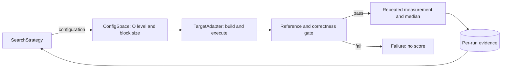
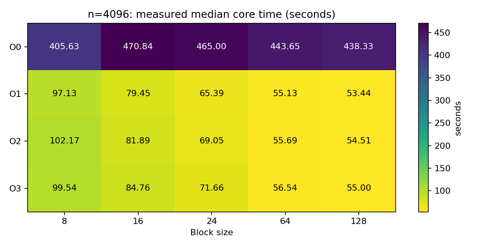
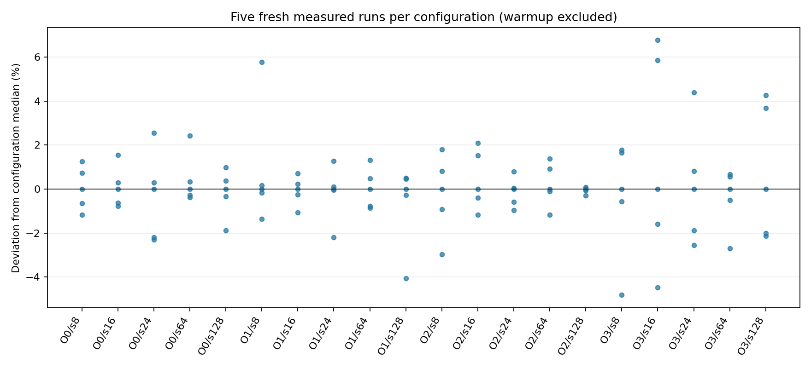

# P1: Matrix Multiplication Autotuner

学号：10245102457 
姓名：谷秉仁

> P2 已完成运行契约修复、统一测量、三策略诊断、20/20 正式 Grid 和候选独立复测，
> 等待外部审计；P3干净验收已通过、首批已恢复串行测量，完整两算法比较尚未完成。
> 历史 pilot 不追认为 Grid，P2 不因开始 P3 而视为审计通过。

## 1. 框架设计

框架把目标程序、配置空间和搜索策略分离，搜索算法只能通过统一 Evaluator 获得
自己已评估配置的结果。

`ConfigSpace` 从外部 JSON 读取 `{O0,O1,O2,O3} x {8,16,24,64,128}`；
`TargetAdapter` 负责按尺寸和优化级别构建，并把块大小作为运行参数；`Evaluator`
负责一次执行的超时、资源记录、严格输出解析、正确性门禁和证据保存；
`ConfigurationEvaluator` 负责统一的一次预热与五次独立测量。构建缓存键包含源码、
编译器完整版本、完整选项和尺寸，reference 与性能结果使用独立缓存。

优点是所有算法共享输入、正确性和测量规则，失败不能获得分数，并能分别报告目标
核心时间与调优总成本。代价是全量 reference、逐元素验证、预热和重复运行显著增加
时间与磁盘 I/O；严格资源门禁还可能推迟正式实验。

P1-R1 修复了初次提交中 `.gitignore` 误忽略 `autotuner/core.py` 的交付缺陷，并从
无 Git 元数据和字节码缓存的内容提交归档完成导入、CLI、单元测试、实际评估和小规模
正确性复验。原有默认规模 pilot 不重跑，仍按修订前诊断数据保留。

## 2. 目标程序与重点代码

老师程序是 C 语言、行主序 `double` 矩阵，默认尺寸 4096。工作副本保持
`ih-jh-kh-il-kl-jl` 分块循环和 `C += A * B` 语义，尾块用边界条件覆盖。默认
`MATRIX_N=4096`，诊断构建才覆盖尺寸；块大小严格限制为 `1 <= s <= n`。

输入由固定的 `splitmix64-interleaved-v1` 规则生成，默认种子 20261008。核心计算
用 `CLOCK_MONOTONIC` 与 `double` 计时；初始化、reference 读取、逐元素验证、结果
checksum 和输出均在计时区外。输出是单行 JSON。每个结果和 reference 元素、误差、
checksum 与时间必须有限；判据在运行前固定为
`abs_error <= 1e-12 + 1e-12 * abs(reference)`。

运行器还核对退出码0、输出schema/status、n/s/seed/input/生成规则与实际请求一致、
checked_entries=n²和容差未被放宽。退出64/65即使携带成功JSON也无分数；合法
参数拒绝和校验失败必须有相符的错误契约。预热或任一次测量失败时，不对成功子集
求中位数；构建/reference缓存可复用，但正式性能样本全部强制重新运行。

正式尺寸 reference 由独立非分块 `double i-k-j` 实现生成一次并缓存，再以 16 个
固定坐标的 `long double` 点积复核。缓存 manifest 记录输入、代码、二进制和数据哈希；
128 MiB 数据及构建产物留在 WSL 本地，不提交仓库。

## 3. 正确性验证

`n=129` 和 `n=130` 对 20 个配置全部测试，每个尺寸使用两个不同随机种子、零矩阵
和单位矩阵，共 160 次，全部通过独立逐元素 `long double` reference。两种尺寸均
覆盖分块不能整除矩阵的尾块，且 `s=128` 覆盖接近整矩阵的情况。

有限错误、结果 NaN/Inf、reference NaN、时间 NaN、checksum NaN、误差摘要 NaN
共 7 类故障均被拒绝且无性能分数。块大小 0、块大于 n、尾随字符、负种子、缺少与
多余参数共 6 类非法输入均明确分类为参数拒绝。运行器还区分崩溃、超时、编译失败、
输出解析失败、reference 失败与资源拒绝。ASan+UBSan 代表测试无诊断。

## 4. 实验环境与有限试跑

| 项目 | 信息 |
|---|---|
| 宿主 | Windows 11 家庭中文版 25H2，build 26200.9457 |
| 实验环境 | WSL2 Ubuntu 24.04 LTS，kernel 6.18.40.1-microsoft-standard-WSL2 |
| CPU | AMD Ryzen 9 7940HX，16 核 32 线程 |
| 可见内存 | Windows 约 15.22 GiB，WSL 约 7.36 GiB；可用量逐次采集 |
| WSL 缓存 | L1d 512 KiB、L1i 512 KiB、L2 16 MiB、L3 32 MiB |
| 编译器 | GCC 13.3.0，`/usr/bin/gcc` |
| 运行器 / 绘图 | WSL Python 3.12.3；Windows Python 3.12.6、matplotlib 3.10.6、numpy 2.3.3 |

默认矩阵三份约384MiB。reference文件128MiB，候选按行读取（额外行缓冲32KiB），
不再常驻分配第四个完整矩阵；文件系统缓存可能另外占用内存。试跑前功能门禁通过，但 Windows
宿主未达到预先要求的 4 GiB 正式稳定性门槛，所以以下结果仅验证成本与链路。

块大小 64、随机种子 20261008 的 `n=4096` 核心时间为：O0 `421.266406 s`、O1
`79.839050 s`、O2 `49.390784 s`、O3 `79.570400 s`。四者均逐元素匹配缓存
reference。O3 预热后五次为 `78.552165、78.081704、78.789159、80.035354、
79.960097 s`；中位数 `78.789159 s`、CV `1.10%`、相对 MAD `0.90%`。
单个块大小上 O2 较快不等于完整配置空间的最终结论。

以上是修订前P1 pilot，不是P2 Grid。P2把宿主与WSL可用内存门槛统一为2GiB，
根目录至少1GiB，宿主CPU五次采样平均≤10%、单次≤20%。依据是候选实际峰值
RSS约386MiB及reference生成的约384MiB需求；该门槛及全部测量规则在正式运行前
冻结。每配置开始前重新检查门禁，运行期间保留宿主内存/提交量/分页和WSL
swap、vmstat、memory PSI样本；宿主和WSL的可用内存分别判断，不互相替代。

WSL 缺少匹配内核的 `perf` 工具，CPU 温度、可靠的 governor/boost 状态与硬件性能
计数器数据未知。因此目前只能依据时间和算法/访存结构提出机制假设，不能把它们写成
已经由硬件计数器证明的事实。

## 5. 搜索与公平测量方法

正式协议为串行运行、同一输入、正确性先行、每配置一次预热和五次测量，以核心时间
中位数计分；任一次失败则配置无效。O0/O1/O2/O3 超时分别固定为
`1271/244/151/243 s`。候选时间与构建、reference、验证、墙钟和总搜索成本分开。

Grid 以优化级别为外层、块大小为内层遍历全部 20 个配置。无放回随机搜索对 20 个
配置做种子化 Fisher--Yates 排列。随机重启贪心每次只改变一个参数到任意其他合法
值，每点共有 3 个优化级别邻居和 4 个块大小邻居；只接受严格改善，无改善或邻居
用尽则从未评估配置重启。预算为 4、8、12，
4/8 是同一条 12 次轨迹的前缀；初始五个种子为 20261008--20261012。算法只能读取
自身已评估数据，最终候选必须独立复测。

完整 20 配置 Grid 的最优有效结果作为后续算法质量参照。若同时报告 Grid 的
4/8/12 配置前缀，必须注明固定遍历顺序及其可能引入的前缀偏置。该规则在任何正式
搜索开始前由 P1-R1 修订并版本化。

原先约 6 小时是初始估计，不是完成承诺。根据本次完整 Grid 的配置评估墙钟累计
20088.175 s，均摊约 1004.409 s/配置，每种随机算法五种子各 12 配置约需
60264.524 s（16.74 h）；两种约 33.48 h，另加资源等待、失败、setup 和候选复测。
这是当前配置均摊成本的条件估计，不保证随机轨迹的配置组成相同，也不是已校准物理时间。
P3 建议先完成一个种子的 12 次轨迹、核查实际成本，再分批覆盖五种子；4/8 的前缀
不增加评估预算。上述估计来自 P2；用户随后授权启动 P3，精确预算与分批规则见
[`P3_PROTOCOL`](docs/P3_PROTOCOL.md)。P3 实际数据尚待运行，不用估计填报结果。

## 6. P2 正式完整 Grid

正式内容提交为`0d3dd5242c728d8001dd02a4e332185459d04721`，n=4096、random输入、
种子20261008，输入生成规则及乘法循环不变。规范顺序为O0/O1/O2/O3外层、
s=8/16/24/64/128内层。20个唯一配置全部有效：20次预热、100次独立测量；
每次退出0、finite检查通过、逐元素校验16777216项、零错配，max_abs_error=0。
独立reference的16个long double采样全部通过（最大绝对误差约3.96e-12、相对
误差约3.95e-15，符合预设判据）；并非声称对4096做了全矩阵long double计算。

### 6.1 核心时间与独立复测

下表是各配置五次新测量的中位数，单位为该环境的CLOCK_MONOTONIC秒，预热不计分。
完整精度及均值、样本标准差、CV、MAD、进程墙钟在
[`grid_summary.csv`](evidence/p2/grid-session-0d3dd52/grid_summary.csv)。

| 优化级别 / s | 8 | 16 | 24 | 64 | 128 |
|---|---:|---:|---:|---:|---:|
| O0 | 405.629870 | 470.839455 | 464.997551 | 443.647464 | 438.329346 |
| O1 | 97.132775 | 79.445990 | 65.389033 | 55.128554 | 53.444628 |
| O2 | 102.174544 | 81.886364 | 69.050234 | 55.687057 | 54.505498 |
| O3 | 99.538986 | 84.761687 | 71.655194 | 56.542559 | 54.995413 |

本会话**测得最低中位数**为O1/s=128。Grid五次为53.710804139、53.687048943、
53.301665681、53.444627760、51.281525509 s；独立组重新预热后五次为
54.779446389、55.174462139、54.467224360、56.161193077、54.074720667 s。
两组均使用相同输入、reference与协议，全部force_remeasure=true；复测不改原Grid表。

| O1/s=128 | 中位数(s) | 均值(s) | 样本标准差(s) | CV | MAD(s) |
|---|---:|---:|---:|---:|---:|
| Grid | 53.444627760 | 53.085134406 | 1.022605745 | 1.9264% | 0.242421183 |
| 独立复测 | 54.779446389 | 54.931409326 | 0.797483326 | 1.4518% | 0.395015750 |

独立复测中位数高2.4976%，大于O1与O2/O3在s=128的原表差距，因此不能断言O1
是稳定环境下的真正最优优化级别。20组CV范围为0.1441%--4.7865%，最高为O3/s=16。
下图保留100个计分样本，不删除较慢值；预热、复测及中断部分不混入图中。

### 6.2 成本、暂停与完整性

UTC时间戳从2026-10-08 15:26:07至2026-10-09 00:14:46（UTC+8），跨度约
8 h 48 min 39 s，包含用户低电量关机暂停。UTC曾调整，此跨度与单调计时成本
不是同一时钟域；不得相减来声称精确的暂停或缺失成本。

| 成本项 | 记录秒数 | 范围 |
|---|---:|---|
| 活动会话 | 23908.150 | 约6 h 38 min 28 s；含门禁/等待，不含未落检查点的关机前间隔 |
| 资源门禁/等待 | 2153.500 | 约35 min 54 s；活动会话的子项 |
| 四级候选构建setup | 2.988 | setup阶段实际编译 |
| reference setup | 35.092 | 含reference构建/生成/身份核查；生成核心33.247 s |
| 完整Grid配置评估 | 20088.175 | 20组的统一接口墙钟；不含启动门禁等待 |
| 完整Grid目标进程 | 19997.806 | 上项中的120个进程；核心19840.530 s、验证85.124 s |
| 独立复测配置评估 | 338.596 | 另组1预热+5测量；目标进程334.462 s |
| 全部完整目标进程 | 21605.941 | 129条，含3条放弃记录；核心21434.372 s、验证93.152 s |
| 放弃的完整目标进程 | 1273.673 | 原O0/s16的3条部分执行，不计分 |
| 无完整结果的中断进程 | ≥325 | 最后观察到的进程耗时下界，最终退出及精确成本未知 |

各项有包含关系，不能全部相加。每次build/reference查找另计0.181/26.252 s，包含
在配置评估中；大型缓存留在WSL。旧grid-main的SIGPIPE执行和其reference成本单独
保留，未拼入当前session。暂停后原O0/s16整组重新预热和测量，无性能缓存样本。
证据审计复算所有统计量并核对唯一ID、原始输出、退出码、门禁与哈希，完整性PASS：
120条Grid+6条复测+3条放弃完整记录，另1条无完整结果的中断执行。
[`成本与资源审计`](evidence/p2/grid-session-0d3dd52/evidence_audit.json)、
[`后处理命令及哈希`](evidence/p2/postprocessing/summary.json)。

### 6.3 资源与解释限制

70次正式门禁记录中24次PASS，失败期间暂停启动新增配置；运行中只采集，不按事后
门槛筛选成功子集。129个完整进程峰值RSS最多394856 KiB（385.60 MiB），逐进程
major fault全部0。WSL运行中最低可用内存约3.37 GiB、swap使用与pswpin/pswpout均0；
这不代表宿主无压力。718个宿主快照有197个低于2 GiB，41个CPU超过20%，最低可用
约99.5 MiB，CPU峰值62%；系统提交百分比最高65%，pages/sec与page_reads/sec
最高116140/60201。它们是全系统指标，不可直接归因于候选。

23:49只读快照记录游戏进程工作集约2.76 GiB和宿主内存不足；用户后续表示自行关闭
高负载应用并继续。资源恢复后门禁才允许后续组启动；主控未关闭应用或改系统设置。
游戏、监控、日志/Git操作、关机及充电变化的独立扰动没有量化，不能声称运行环境
全程静止。CPU平均10%/单次20%是启动前背景负载的本项目质量条件，不限制目标
进程；温度、节流、可靠boost状态、硬件计数器与压缩内存仍未知。

时钟探针发现REALTIME跳变及MONOTONIC/RAW间隔差异，直接syscall未证实可消除
差异；没有独立物理时间校准。所有分数保持冻结计时源原样，不校准、不丢弃样本。
绝对秒数和小幅排序需谨慎解释。见[`P2_TIMING_NOTE`](docs/P2_TIMING_NOTE.md)。
审计PASS证明记录/契约/完整性一致，不证明背景资源或跨宿主计时精度稳定。

### 6.4 性能机制与后续比较边界

已测事实：O1/O2/O3均显著快于O0；优化档中块大小增大时本次中位数下降，而O0
最小值在s=8；更高优化级别没有保证更低时间。源码的内层j对行主序B、C连续访问。
循环控制开销、分块后的局部性、编译优化改变指令及寄存器利用是候选解释，尚没有
汇编或硬件计数器证据验证因果关系。安装编译器的`gcc -Q -O[level] --help=optimizers`
显示O0/O1关闭tree loop/SLP vectorize，O2/O3开启；O2代价模型very-cheap、O3为
dynamic。这仅说明选项启用，不证明该矩阵循环实际向量化，也不能解释O1胜出。
[`编译器原始输出`](evidence/p2/environment/memory_pause_tools_20261008.json)。

作为后续参照，规范Grid前4/8/12配置的最低中位数分别为405.629870345、
65.389032579、53.444627760 s，相对完整表最低值高658.9722%、22.3491%、0%。
这是固定遍历顺序的前缀偏置，不是随机或贪心搜索结果。后续策略不得读取本表来
作决策；完整Grid只在轨迹结束后用于质量比较。正式随机/贪心跨种子结果待P3，
时钟/背景扰动是否要求新环境新session复测，先交外部审计者裁决。

## 7. P3：正式搜索比较（首批续跑中，暂无完整结论）

P3内容提交 `e308bfb873e6811c50ad685a979af345302fda8d`，新增campaign运行与独立
后处理，不改变P2 C/core/measurement/search源码、输入、容差或核心计时。搜索
schema 2保持不变，campaign schema 1在P3正式分数出现前冻结种子次序、预算前缀
与复测方式，规范化哈希为`bf7e5fd63656c6bb68714cffd8a060bac8e17db15138ef1b88e8b59b6d5c7461`。

无放回随机与七邻居重启贪心各运行五个冻结种子，每轨迹12次唯一配置，4/8作为前缀。
首批先跑20261008的两条轨迹；各预算不同候选各独立复测，复测不反馈策略。
策略不读取Grid或其他轨迹；恢复只重放自身有序观测。完整P2表只用于后处理评价
配置选择，相对P2的跨session时间差另列，不能把负时间差解释为真正全局最优。

干净归档没有.git或初始pycache，移除PYTHONPATH：40项单测、n17/O2/s8 fresh正确
通过；n130十轨迹共120次配置、720次搜索+114次独立复测=834次新执行通过。
另实际验证一条部分样本暂停，恢复后放弃旧组并完整重新测量；完成批次恢复不新增
目标执行。这些是链路诊断，不是n4096算法质量数据，不能据此声称搜索优劣。
证据与续跑见[P3审计入口](docs/P3_AUDIT_HANDOFF.md)。P3正式预算表与五种子稳定性
尚待批次完成后填写，继承P2时钟未校准与资源非平稳的限制。

首批01:42快照仅完成1/24配置：O1/s64中位数54.993200129秒、CV1.2048%，六次
全矩阵通过。O0/s24只有预热通过，不产生分数；不能把这个快照当作4/8/12预算的
算法比较或完整P3结论。完整计划仍为两算法各五种子、总120次轨迹内去重配置评估。

后续进度：O0/s24完整五次测量中位数467.876385448秒、均值467.706472674秒、
样本标准差1.7528160454秒、CV0.3748%、MAD1.201713070秒；全部六次全矩阵通过。
首批已完成2/24配置、共12条目标执行；02:24在第三配置前的16次资源门禁均失败后
保存检查点并退出。10:12复查宿主最低可用内存约433MiB，CPU平均4.4%/最大12%，
WSL可用约3.87GiB、swap使用0。限制是宿主内存，未放宽门槛或停止其他应用。
尚无任何完整4/8/12预算前缀或正式候选复测，不能填报算法质量比较。
[暂停后的原始一致性复核](evidence/p3/resource-paused-audit/audit.json)和
[带时间资源复查](evidence/p3/environment/terminal_gate_20261009_101207.json)。

10:40资源门禁恢复PASS（宿主5.70GiB、WSL3.90GiB，CPU平均4.4%/最大16%），
沿用原内容提交和session续跑，完整旧组原样保留。10:42:55第三配置O3/s16开始预热；
[恢复验证](evidence/p3/resume-20261009-104020/restoration.json)只证明身份和恢复链路，
不构成新配置分数或搜索比较结论。历史暂停数据与环境限制不删除、不事后筛样本。

## 8. 复现入口

快速检查运行 `python3 scripts/verify_p1.py` 和
`python3 -m unittest discover -s tests -v`。结构化摘要位于
`evidence/p1/correctness/summary.json` 与 `evidence/p1/pilots/summary.json`，完整
逐次记录分别位于同目录 JSONL 文件。测量与搜索冻结规则位于 `configs/`。

本轮干净归档回归在`evidence/p2/validation-final/`：31项单测、160个正确性案例、
7类故障和6类非法参数通过；n=130实际Grid20/随机8/贪心8均通过统一配置接口。
提交后的交付归档复验另存`evidence/p2/validation-delivery/`，内容提交
`c2a964162915b8cf0019df4e73bcd7cd634d1902`的同一套回归全部PASS，独立空缓存
n17 fresh及n130三策略20/8/8通过，20个Python文件AST和已提交正式证据审计通过。
这不改正式实验身份。正式续跑、身份核验及完整证据审计命令见README。
策略诊断不构成正式算法质量比较。报告图片均为仓库相对路径。
